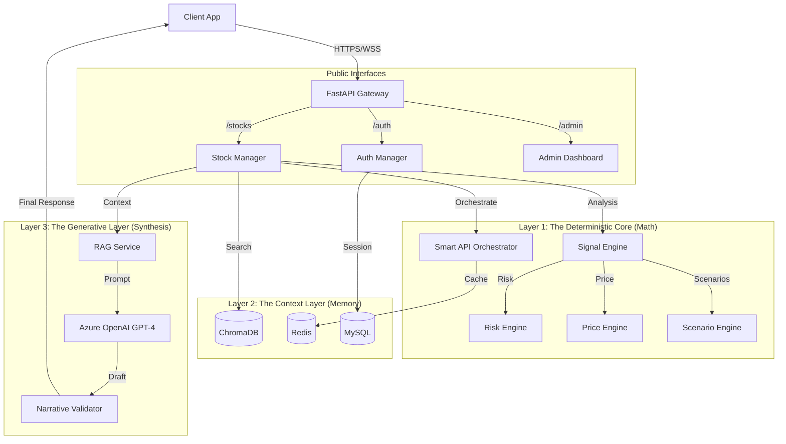
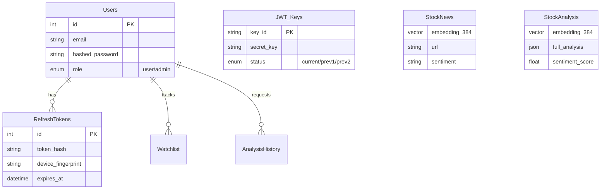

# NeuroVest Backend Master Architecture & Reference

> **System Version**: 2.0 (Hybrid-RAG + Smart Orchestrator)
> **Platform**: FastAPI, Python 3.10+, Redis, MySQL, ChromeDB
> **Documentation Level**: **Comprehensive / "The Bible"**
> **Last Updated**: January 2026

---

## 📋 Table of Contents

1.  [**System Blueprint & High-Level Design**](#1-system-blueprint--high-level-design)
2.  [**Infrastructure & Database Topology**](#2-infrastructure--database-topology)
3.  [**Smart API Orchestrator (Data Layer)**](#3-smart-api-orchestrator-data-layer)
4.  [**The 7-Engine Deterministic Core**](#4-the-7-engine-deterministic-core)
5.  [**Hybrid-RAG & AI Architecture**](#5-hybrid-rag--ai-architecture)
6.  [**End-to-End Data Flow (The 11 Steps)**](#6-end-to-end-data-flow-the-11-steps)
7.  [**Security, Rate Limiting & Auth**](#7-security-rate-limiting--auth)
8.  [**API Reference & Schemas**](#8-api-reference--schemas)
9.  [**Logging & Observability**](#9-logging--observability)

---

## 1. System Blueprint & High-Level Design

NeuroVest represents a paradigm shift from "Black Box AI" to **"Glass Box AI"**. It does not rely on LLMs for financial calculations. Instead, it uses a **Hybrid-RAG** architecture where a deterministic mathematical core feeds proven facts to a generative narrative layer.

### 🏛️ Architectural Diagram



---

## 2. Infrastructure & Database Topology

The system utilizes a **3-Tier Polyglot Persistence** strategy.

### 2.1 Database Schema Overview



### 2.2 Component Specifications

| Component | Technology | Usage | Key Configuration |
| :--- | :--- | :--- | :--- |
| **Relational DB** | MySQL 8.0 | User Data, Auth, Logs | `InnoDB`, `utf8mb4`, Pool Size: 20 |
| **Vector DB** | ChromaDB | RAG Content, History | `all-MiniLM-L6-v2` (384-dim), Local Storage |
| **Cache Store** | Redis 7-alpine | Rate Limits, API Cache | `allkeys-lru`, 256MB Max Memory |
| **AI Model** | Azure OpenAI | Narrative Generation | `GPT-4`, Region: `eastus2`, Temp: 0.3 |

---

## 3. Smart API Orchestrator (Data Layer)

**Location**: `app/services/stock_api_service.py`
The Orchestrator is the gateway to the outside world. It is self-healing, market-aware, and redundant.

### 3.1 multi-Vendor Routing Table

| Market | Primary Provider | Secondary Provider | Fallback Provider |
| :--- | :--- | :--- | :--- |
| **India (.NS)** | **Yahoo Finance** | Alpha Vantage | Marketstack |
| **USA** | **Finnhub** | Marketstack | Yahoo Finance |
| **Crypto** | **Alpha Vantage** | Yahoo Finance | - |
| **Forex** | **Alpha Vantage** | Finnhub | - |

### 3.2 Circuit Breaker Logic
*Prevents cascading failures when a provider goes down.*
-   **Threshold**: 5 failures in 5 minutes.
-   **Action**: "Trip" the breaker (exclude provider from rotation).
-   **Cooldown**: 300 seconds (5 minutes) before "Half-Open" test state.
-   **Storage**: Redis keys `circuit_breaker:{provider_name}:failures`.

### 3.3 External APIs Used
1.  **Finnhub**: Real-time US prices, company profiles.
2.  **Alpha Vantage**: FX, Crypto, Technical Indicators.
3.  **Yahoo Finance (`yahooquery`)**: Indian markets, historical data backlog.
4.  **Marketstack**: Global exchanges backup.
5.  **DuckDuckGo**: Real-time news scraping.

---

## 4. The 7-Engine Deterministic Core

The "Brain" of NeuroVest. These engines run **synchronously** (currently) to produce math-based facts.

| Engine | Responsibility | Logic / Algorithm | Output |
| :--- | :--- | :--- | :--- |
| **1. Signal Engine** | Technical Direction | Trend (EMA/SMA), Momentum (RSI), Volatility (ATR) | `Bullish`, `Bearish`, `Neutral` |
| **2. Risk Engine** | Quantify Danger | Weighted Sum: `TrendRisk` + `VolRisk` + `NewsRisk` | Score: `0-100` (Low/Med/High) |
| **3. Price Engine** | Market Structure | Pivot Points, Value Areas, Psychological Zones | Support/Resistance Zones |
| **4. Scenario Engine** | **Probabilistic Forecasting** | `If StrongTrend & LowVol`: Bull(65%), Base(25%), Bear(10%) | 3 Scenarios with % Probability |
| **5. Sentiment Engine** | News Analysis | LLM Classification of Headlines (-1 to +1) | Aggregate Sentiment Score |
| **6. Backtesting** | Accountability | Stores "Snapshot" of prediction vs reality | `SnapshotID` |
| **7. Narrative Validator** | **Anti-Hallucination** | Regex + Logic checks on LLM output | `Valid` / `Invalid` |

---

## 5. Hybrid-RAG & AI Architecture

### 5.1 The "Sandwich" Method
Most RAG apps do: `User Question -> Retrieve -> LLM Answer`.
NeuroVest does:
1.  **Deterministic Layer (Bottom)**: Calculate Signals, Risk, Scenarios (Hard Math).
2.  **Retrieval Layer (Middle)**: Fetch News + Historical Analyses (Context).
3.  **Generative Layer (Top)**: "Here is the math and the history. Narrate this."

### 5.2 Prompt Engineering Strategy
We use **Structured Prompting** with two distinct modes:

**Mode A: Base Analysis** (No history)
> "Analyze this stock based on these valid technical signals..."

**Mode B: Synthesis Analysis** (History exists)
> "Previously (3 days ago), we predicted a breakout. The price has since moved +2%. The RSI has cooled from 75 to 60. Synthesize this evolution."

### 5.3 Validator Guardrails
The `NarrativeValidator` checks the LLM's JSON output for:
-   **Forbidden Terms**: "Guaranteed", "Safe Bet", "Buy Now".
-   **Hallucinations**: Citations of prices not in the OHLC data.
-   **Tone Mismatch**: "Panic" words when Risk Score is < 30.

---

## 6. End-to-End Data Flow (The 11 Steps)

**Total Latency**: ~2.8s (avg)

1.  **Ingestion (800ms)**: Smart Orchestrator fetches OHLCV + News.
2.  **Tech Calc (50ms)**: Signal Engine computes RSI, MACD, BB.
3.  **Classification (150ms)**: Trend/Momentum/Vol classified as "Strong", "Weak", etc.
4.  **Structure (20ms)**: Price Engine identifies Key Levels.
5.  **Risk Scoring (80ms)**: Risk Engine aggregates tech + sentiment risk.
6.  **Scenario Gen (10ms)**: **Deterministic Probability Calculation.**
7.  **Snapshot (5ms)**: Backtesting Engine saves state.
8.  **Retrieval (150ms)**: RAG Service fetches ChromaDB history.
9.  **Generation (1.8s)**: Azure OpenAI GPT-4 synthesizes the narrative.
10. **Validation (20ms)**: Narrative Validator sanitizes output.
11. **Storage (50ms)**: Result saved to MySQL (History) & Chroma (Vector).

---

## 7. Security, Rate Limiting & Auth

### 7.1 "4-Dimensional" Rate Limiting
We track usage across 4 dimensions to prevent evasion.
-   **IP Address**: `hash(ip)`
-   **User ID**: `sub` from JWT.
-   **Session ID**: `X-Session-ID` header.
-   **Device Fingerprint**: `X-Device-Token` (Signed HMAC).

| Tier | Limits (Analysis) | Limits (API) |
| :--- | :--- | :--- |
| **Guest** | 5 / day | 60 / min |
| **User** | 50 / day | 120 / min |
| **Admin** | Unlimited | Unlimited |

### 7.2 Zero-Downtime Key Rotation
-   **Storage**: MySQL `jwt_keys` table (Source of Truth) -> Redis (Cache).
-   **Logic**: Keys rotate every 24h.
-   **Verification Window**: The system accepts signatures from the **Current Key** AND the **2 Previous Keys** (72h window).
-   **Benefit**: No "Logged out due to security update" events for users.

---

## 8. API Reference & Schemas

### 🟢 `POST /stocks/{ticker}/analysis`
**Description**: Triggers the full 11-step analysis pipeline.
**Request**:
```json
// Empty body, params in URL. Header: Authorization: Bearer <token>
```
**Response**:
```json
{
  "ticker": "RELIANCE",
  "market_state": {
    "trend": "bullish",
    "momentum": "strong"
  },
  "scenarios": [
    {
      "type": "bull_case",
      "probability": 0.65,
      "description": "Breakout above 2500",
      "targets": [2550, 2600]
    },
    { "type": "bear_case", "probability": 0.15, ... }
  ],
  "risk": {
    "score": 35,
    "level": "moderate"
  },
  "narrative": {
    "summary": "Reliance is showing strong accumulation...",
    "prediction": "Expect a test of 2550 key resistance."
  }
}
```

### 🟢 `GET /stocks/search`
**Query**: `?query=Tata`
**Response**:
```json
{
  "results": [
    { "symbol": "TATASTEEL.NS", "name": "Tata Steel Ltd", "type": "Equity" },
    { "symbol": "TATAMOTORS.NS", "name": "Tata Motors", "type": "Equity" }
  ]
}
```

### 🟢 `POST /auth/login`
**Request**:
```json
{ "email": "admin@neurovest.ai", "password": "..." }
```
**Response**:
```json
{
  "access_token": "ey...",
  "refresh_token": "ey...",
  "token_type": "bearer",
  "device_verified": true
}
```

---

## 9. Logging & Observability

### 9.1 Log Streams
1.  **Application Logs** (`stdout`): Structure: `[TIME] [LEVEL] [MODULE] - Message`.
2.  **Security Logs** (`security.log`): Failed logins, rate limit hits, kill switch activations.
3.  **Audit Logs** (`MySQL: admin_audit_logs`): Admin actions (Ban user, Change config).

### 9.2 Operation Tracking
Every "Heavy" operation (Analysis, Ingestion) generates an `OperationLog` entry in MySQL:
-   `operation_id`: UUID
-   `target`: Ticker symbol
-   `latency_ms`: Time taken
-   `status`: Success/Failure
-   `metadata`: Provider used, token usage.

---
**End of Master Architecture Document**
