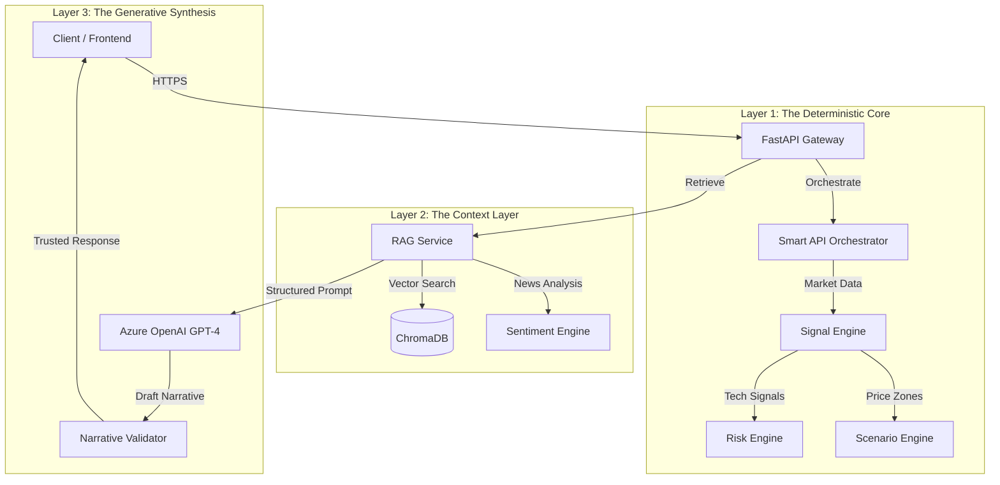

# NeuroVest - Advanced AI Stock Analysis System


> **"Glass Box AI" for the Indian Stock Market.**
> NeuroVest combines a **Deterministic Mathematical Core** with **Generative AI** to provide grounded, hallucination-free stock analysis.

---

## 🏗️ System Architecture

NeuroVest employs a specific **Hybrid-RAG** architecture called "The Sandwich," where the AI is sandwiched between layers of hard mathematical verification.



---

## 🧠 The 7-Engine Deterministic Core

Unlike most AI apps that ask the LLM "What do you think?", NeuroVest **tells** the LLM what to think based on math.

1.  **Signal Engine**: Calculates RSI, MACD, Bollinger Bands, and identifies Trend/Momentum/Volatility states.
2.  **Risk Engine**: Aggregates technical risks + sentiment risks into a 0-100 Danger Score.
3.  **Price Engine**: Identifies Supply/Demand zones using Pivot Points and Volume Profiles.
4.  **Scenario Engine**: **(Unique Feature)** Probabilistic forecasting. It calculates 3 specific scenarios (Bull/Base/Bear) and their probabilities *before* the AI is even called.
5.  **Sentiment Engine**: Scrapes news, classifies headlines (-1 to +1), and detects market mood.
6.  **Backtesting Engine**: snapshots every prediction to track accuracy over time.
7.  **Narrative Validator**: Regex-based guardrails that catch AI hallucinations (e.g., citing a price that doesn't exist).

---

## 🛡️ Security & Privacy

We implement a military-grade **"Defense in Depth"** strategy.

### 1. 4-Dimensional Rate Limiting
Attackers cannot evade bans by simply changing their IP. We track 4 distinct fingerprints:
1.  **IP Address**: `hash(X-Forwarded-For)`
2.  **User ID**: Authenticated `sub` claim.
3.  **Session UUID**: Browser session tracking.
4.  **Device Fingerprint**: **Signed HMAC-SHA256 Token**.
    *   The server cryptographically signs the client's device characteristics. If a token is stolen and used on a different device, the signature mismatch blocks the request immediately.

### 2. Zero-Downtime Key Rotation
-   **Method**: Sliding Window (3 Keys).
-   **Cycle**: Keys rotate every 24 hours.
-   **Validity**: Tokens signed by yesterday's key (Previous_1) or the day before (Previous_2) are still accepted.
-   **Benefit**: Users are never forcibly logged out due to security updates.

### 3. Encryption
-   **At Rest**: User passwords (bcrypt), Device Tokens (HMAC).
-   **In Transit**: HTTPS (TLS 1.3), `httpOnly` Cookies for JWTs (prevents XSS theft).

---

## 🚀 The Data Pipeline

Each analysis request triggers a highly optimized 11-step pipeline (~2.8s total latency).

1.  **Ingestion (800ms)**: Smart Orchestrator routes requests to the fastest available API (Yahoo/Finnhub/AlphaVantage) with circuit breaker protection.
2.  **Technical Calc (50ms)**: Computed locally using Pandas/NumPy.
3.  **Scenario Generation (10ms)**: Probabilities calculated based on Trend Strength.
4.  **Retrieval (150ms)**: Vector search finds similar historical market conditions from ChromaDB.
5.  **Synthesis (1.8s)**: GPT-4 writes the narrative, referencing the computed scenarios and historical context.
6.  **Validation (20ms)**: Output is sanitized and strictly checked against facts.

---

## 📦 Infrastructure & Setup

### Prerequisites
-   Docker & Docker Compose
-   Azure OpenAI API Key
-   Python 3.11+ (for local dev)

### Quick Start (Docker)

```bash
# 1. Clone the repo
git clone https://github.com/AshutoshKY/NeuroVest.git
cd NeuroVest

# 2. Setup Env
cp backend/.env.example backend/.env
# Edit backend/.env with your keys

# 3. Launch
docker-compose up -d --build
```

### Environment Variables

| Variable | Description | Default |
| :--- | :--- | :--- |
| `AZURE_OPENAI_API_KEY` | Your AI Key | Required |
| `JWT_SECRET_KEY` | Master key for signing | Required |
| `USE_SMART_ORCHESTRATOR` | Enable multi-vendor routing | `True` |
| `RATE_LIMIT_ENABLED` | Enable 4D Limiter | `True` |
| `CHROMA_DB_PATH` | Vector Store Location | `./data/chroma` |

---

## 🔧 Management & Config

### Admin Command Center
Access the dashboard at `/admin-login`.
-   **Monitor**: Real-time CPU/Memory/Redis stats.
-   **Control**: Toggle generic "Kill Switches" (`BLOCK_SIGNUPS`, `EMERGENCY_SHUTDOWN`).
-   **Audit**: View security logs and banned IPs.

### Customizing Engines
-   **Risk Weights**: Adjustable in `app/risk_engine/scoring.py`.
-   **Scenario Probabilities**: Logic defined in `app/scenario_engine/probabilities.py`.

---

## 📜 Documentation Index

For deep technical dives, refer to the root documentation files:

-   📖 **[BACKEND_MASTER_ARCHITECTURE.md](./BACKEND_MASTER_ARCHITECTURE.md)**: The "Bible" - 500+ lines of deep architectural detail.
-   🛡️ **[BACKEND_SECURITY_AUDIT_REPORT.md](./BACKEND_SECURITY_AUDIT_REPORT.md)**: Detailed security analysis, risks, and roadmap.
-   📂 **[docs/](./docs/)**: Folder containing specific module documentation.

---

**Built with ❤️ for the Indian Market.**
