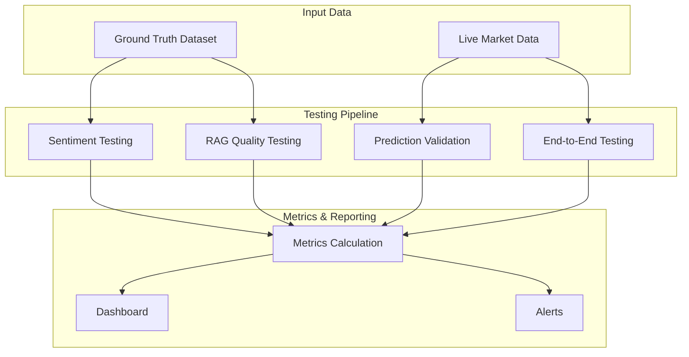
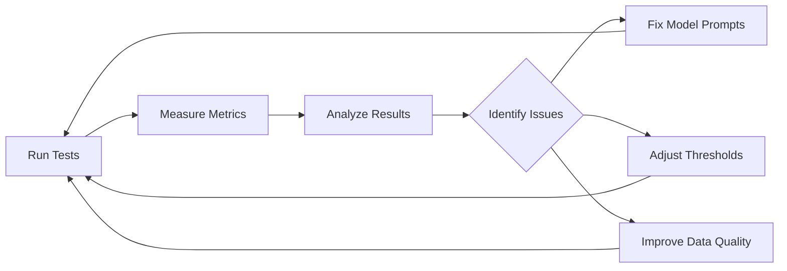

# Analysis & Prediction Testing Pipeline

## Overview
This document outlines a comprehensive testing framework to evaluate the accuracy of stock analysis and predictions generated by the AI system.

---

## 1. Testing Framework Architecture



---

## 2. Sentiment Analysis Accuracy Testing

### 2.1 Create Ground Truth Dataset

**File**: `backend/tests/test_sentiment_accuracy.py`

```python
"""
Test sentiment analysis accuracy against labeled dataset.
"""
import pytest
import pandas as pd
from app.services.sentiment import sentiment_service
from sklearn.metrics import accuracy_score, precision_recall_fscore_support, confusion_matrix


class SentimentAccuracyTest:
    """Test sentiment analysis accuracy."""
    
    @staticmethod
    def load_ground_truth():
        """
        Load manually labeled dataset.
        
        CSV Format:
        article_text, true_sentiment, ticker
        "HAL wins contract...", "bullish", "HAL"
        "Market concerns over...", "bearish", "TCS"
        "No significant changes...", "neutral", "INFY"
        """
        return pd.read_csv('backend/tests/data/sentiment_ground_truth.csv')
    
    def test_sentiment_accuracy(self):
        """Test overall sentiment classification accuracy."""
        # Load ground truth
        df = self.load_ground_truth()
        
        # Get predictions
        predictions = []
        for text in df['article_text']:
            result = sentiment_service.analyze_sentiment(text)
            predictions.append(result['classification'].lower())
        
        # Calculate metrics
        accuracy = accuracy_score(df['true_sentiment'], predictions)
        precision, recall, f1, _ = precision_recall_fscore_support(
            df['true_sentiment'], 
            predictions,
            labels=['bullish', 'neutral', 'bearish'],
            average='weighted'
        )
        
        # Confusion matrix
        cm = confusion_matrix(
            df['true_sentiment'], 
            predictions,
            labels=['bullish', 'neutral', 'bearish']
        )
        
        print(f"Sentiment Analysis Metrics:")
        print(f"Accuracy: {accuracy:.2%}")
        print(f"Precision: {precision:.2%}")
        print(f"Recall: {recall:.2%}")
        print(f"F1-Score: {f1:.2%}")
        print(f"\nConfusion Matrix:")
        print(f"              Bullish  Neutral  Bearish")
        print(f"Bullish       {cm[0][0]:6}   {cm[0][1]:6}   {cm[0][2]:6}")
        print(f"Neutral       {cm[1][0]:6}   {cm[1][1]:6}   {cm[1][2]:6}")
        print(f"Bearish       {cm[2][0]:6}   {cm[2][1]:6}   {cm[2][2]:6}")
        
        # Assert minimum acceptable accuracy
        assert accuracy >= 0.70, f"Sentiment accuracy {accuracy:.2%} below threshold 70%"
        
        return {
            'accuracy': accuracy,
            'precision': precision,
            'recall': recall,
            'f1': f1,
            'confusion_matrix': cm.tolist()
        }
    
    def test_sentiment_confidence_calibration(self):
        """Test if confidence scores correlate with accuracy."""
        df = self.load_ground_truth()
        
        high_conf_correct = 0
        low_conf_correct = 0
        high_conf_total = 0
        low_conf_total = 0
        
        for _, row in df.iterrows():
            result = sentiment_service.analyze_sentiment(row['article_text'])
            is_correct = result['classification'].lower() == row['true_sentiment']
            
            if result['confidence'] >= 0.7:
                high_conf_total += 1
                if is_correct:
                    high_conf_correct += 1
            else:
                low_conf_total += 1
                if is_correct:
                    low_conf_correct += 1
        
        high_conf_acc = high_conf_correct / high_conf_total if high_conf_total > 0 else 0
        low_conf_acc = low_conf_correct / low_conf_total if low_conf_total > 0 else 0
        
        print(f"\nConfidence Calibration:")
        print(f"High Confidence (>0.7): {high_conf_acc:.2%} accuracy ({high_conf_total} samples)")
        print(f"Low Confidence (<0.7): {low_conf_acc:.2%} accuracy ({low_conf_total} samples)")
        
        # High confidence should have higher accuracy
        assert high_conf_acc > low_conf_acc, "Confidence scores not well-calibrated"


# Run tests
if __name__ == "__main__":
    tester = SentimentAccuracyTest()
    metrics = tester.test_sentiment_accuracy()
    tester.test_sentiment_confidence_calibration()
```

### 2.2 Create Ground Truth Dataset

**File**: `backend/tests/data/sentiment_ground_truth.csv`

```csv
article_text,true_sentiment,ticker
"HAL wins major defense contract worth ₹5000 crore from Ministry of Defence",bullish,HAL
"Company reports strong quarterly earnings beating analyst estimates",bullish,TCS
"Stock crashes 15% on profit warning and revenue miss",bearish,INFY
"Market experts concerned about rising debt levels",bearish,RELIANCE
"Company maintains steady performance with no major changes",neutral,WIPRO
"Quarterly results in line with expectations",neutral,HDFCBANK
"CEO optimistic about future growth prospects in AI sector",bullish,TECHM
"Regulatory challenges pose significant headwinds",bearish,BHARTIARTL
"Trading in narrow range with low volumes",neutral,SBIN
"Major expansion into new markets announced",bullish,TATAMOTORS
```

---

## 3. RAG Quality Testing

### 3.1 Relevance Testing

**File**: `backend/tests/test_rag_quality.py`

```python
"""
Test RAG analysis quality and relevance.
"""
import pytest
from app.services.rag import rag_service
from app.services.embeddings import embedding_service


class RAGQualityTest:
    """Test RAG analysis quality."""
    
    def test_retrieval_relevance(self):
        """Test if retrieved articles are relevant to query."""
        ticker = "HAL"
        
        # Generate analysis (triggers retrieval)
        analysis = rag_service.generate_analysis(
            query=f"Analyze {ticker} stock",
            ticker=ticker,
            n_results=10
        )
        
        # Check references
        references = analysis.get('references', [])
        
        # All references should mention the ticker
        relevant_count = sum(
            1 for ref in references 
            if ticker.lower() in ref.get('source', '').lower() or 
               ticker.lower() in ref.get('url', '').lower()
        )
        
        relevance_ratio = relevant_count / len(references) if references else 0
        
        print(f"\nRetrieval Relevance for {ticker}:")
        print(f"Total References: {len(references)}")
        print(f"Relevant References: {relevant_count}")
        print(f"Relevance Ratio: {relevance_ratio:.2%}")
        
        assert relevance_ratio >= 0.7, f"Relevance ratio {relevance_ratio:.2%} below 70%"
        
        return {'relevance_ratio': relevance_ratio, 'total_refs': len(references)}
    
    def test_analysis_coherence(self):
        """Test if generated analysis is coherent and structured."""
        ticker = "HAL"
        
        analysis = rag_service.generate_analysis(
            query=f"Analyze {ticker} stock",
            ticker=ticker
        )
        
        # Check required fields
        required_fields = ['analysis', 'reasoning', 'prediction', 'risk_factors', 'key_insights']
        missing_fields = [f for f in required_fields if not analysis.get(f)]
        
        assert not missing_fields, f"Missing fields: {missing_fields}"
        
        # Check content length (should be substantial)
        analysis_length = len(analysis['analysis'])
        reasoning_length = len(analysis['reasoning'])
        
        print(f"\nAnalysis Coherence:")
        print(f"Analysis Length: {analysis_length} chars")
        print(f"Reasoning Length: {reasoning_length} chars")
        print(f"Risk Factors: {len(analysis['risk_factors'])}")
        print(f"Key Insights: {len(analysis['key_insights'])}")
        
        assert analysis_length >= 200, "Analysis too short"
        assert reasoning_length >= 100, "Reasoning too short"
        assert len(analysis['risk_factors']) >= 3, "Insufficient risk factors"
        assert len(analysis['key_insights']) >= 3, "Insufficient key insights"
    
    def test_hallucination_detection(self):
        """Test if analysis contains hallucinated facts."""
        ticker = "HAL"
        
        analysis = rag_service.generate_analysis(
            query=f"Analyze {ticker} stock",
            ticker=ticker
        )
        
        # Check if analysis mentions data from references
        references = analysis.get('references', [])
        analysis_text = analysis['analysis'].lower()
        
        # Count how many reference sources are mentioned in analysis
        source_mentions = sum(
            1 for ref in references 
            if ref.get('source', '').lower() in analysis_text
        )
        
        grounding_ratio = source_mentions / len(references) if references else 0
        
        print(f"\nHallucination Detection:")
        print(f"References: {len(references)}")
        print(f"Sources Mentioned in Analysis: {source_mentions}")
        print(f"Grounding Ratio: {grounding_ratio:.2%}")
        
        # Analysis should reference actual sources
        assert grounding_ratio >= 0.3, "Analysis not grounded in retrieved context"


# Run tests
if __name__ == "__main__":
    tester = RAGQualityTest()
    tester.test_retrieval_relevance()
    tester.test_analysis_coherence()
    tester.test_hallucination_detection()
```

---

## 4. Prediction Validation

### 4.1 Track Predictions Over Time

**File**: `backend/tests/test_prediction_accuracy.py`

```python
"""
Test prediction accuracy by tracking actual vs predicted outcomes.
"""
import pytest
import pandas as pd
from datetime import datetime, timedelta
from app.services.rag import rag_service
from app.services.data_ingestion import data_ingestion_service


class PredictionValidation:
    """Validate predictions against actual market outcomes."""
    
    @staticmethod
    def save_prediction(ticker: str, prediction: dict, current_price: float):
        """
        Save prediction to CSV for future validation.
        
        CSV Format:
        timestamp, ticker, prediction_sentiment, prediction_text, price_at_prediction
        """
        df = pd.DataFrame([{
            'timestamp': datetime.now().isoformat(),
            'ticker': ticker,
            'sentiment': prediction['sentiment']['classification'],
            'confidence': prediction['sentiment']['aggregate_score'],
            'prediction_text': prediction.get('prediction', ''),
            'price_at_prediction': current_price
        }])
        
        # Append to file
        df.to_csv('backend/tests/data/predictions_log.csv', mode='a', header=False, index=False)
    
    def validate_predictions(self, days_ago: int = 7):
        """
        Validate predictions made N days ago against actual outcomes.
        
        Args:
            days_ago: How many days back to validate
        """
        # Load prediction log
        df = pd.read_csv('backend/tests/data/predictions_log.csv',
                        names=['timestamp', 'ticker', 'sentiment', 'confidence', 
                               'prediction_text', 'price_at_prediction'])
        
        df['timestamp'] = pd.to_datetime(df['timestamp'])
        
        # Filter predictions from N days ago
        cutoff_date = datetime.now() - timedelta(days=days_ago)
        old_predictions = df[df['timestamp'] < cutoff_date]
        
        results = []
        for _, pred in old_predictions.iterrows():
            # Get current price
            current_data = data_ingestion_service.fetch_stock_data(pred['ticker'])
            current_price = current_data.get('current_price', 0)
            prediction_price = pred['price_at_prediction']
            
            # Calculate actual movement
            price_change_pct = ((current_price - prediction_price) / prediction_price) * 100
            actual_direction = 'bullish' if price_change_pct > 2 else ('bearish' if price_change_pct < -2 else 'neutral')
            
            # Check if prediction matched
            is_correct = pred['sentiment'] == actual_direction
            
            results.append({
                'ticker': pred['ticker'],
                'predicted': pred['sentiment'],
                'actual': actual_direction,
                'price_change_pct': price_change_pct,
                'correct': is_correct,
                'confidence': pred['confidence']
            })
        
        # Calculate metrics
        accuracy = sum(r['correct'] for r in results) / len(results) if results else 0
        
        # Directional accuracy by confidence
        high_conf = [r for r in results if r['confidence'] >= 0.7]
        high_conf_acc = sum(r['correct'] for r in high_conf) / len(high_conf) if high_conf else 0
        
        print(f"\nPrediction Validation ({days_ago} days ago):")
        print(f"Total Predictions: {len(results)}")
        print(f"Overall Accuracy: {accuracy:.2%}")
        print(f"High Confidence Accuracy: {high_conf_acc:.2%}")
        
        # Show sample results
        print(f"\nSample Results:")
        for r in results[:5]:
            status = "✓" if r['correct'] else "✗"
            print(f"{status} {r['ticker']}: Predicted {r['predicted']}, Actual {r['actual']} ({r['price_change_pct']:+.2f}%)")
        
        return {
            'accuracy': accuracy,
            'high_confidence_accuracy': high_conf_acc,
            'total_predictions': len(results),
            'detailed_results': results
        }
    
    def test_directional_correlation(self):
        """Test correlation between sentiment scores and price movements."""
        df = pd.read_csv('backend/tests/data/predictions_log.csv',
                        names=['timestamp', 'ticker', 'sentiment', 'confidence', 
                               'prediction_text', 'price_at_prediction'])
        
        # Calculate actual price changes
        price_changes = []
        sentiment_scores = []
        
        for _, pred in df.iterrows():
            current_data = data_ingestion_service.fetch_stock_data(pred['ticker'])
            current_price = current_data.get('current_price', 0)
            
            price_change_pct = ((current_price - pred['price_at_prediction']) / pred['price_at_prediction']) * 100
            
            # Convert sentiment to score
            sentiment_map = {'bullish': 1, 'neutral': 0, 'bearish': -1}
            sentiment_score = sentiment_map.get(pred['sentiment'], 0) * pred['confidence']
            
            price_changes.append(price_change_pct)
            sentiment_scores.append(sentiment_score)
        
        # Calculate correlation
        import numpy as np
        correlation = np.corrcoef(sentiment_scores, price_changes)[0, 1]
        
        print(f"\nSentiment-Price Correlation: {correlation:.3f}")
        
        return {'correlation': correlation}


# Run validation
if __name__ == "__main__":
    validator = PredictionValidation()
    
    # Validate 7-day old predictions
    metrics = validator.validate_predictions(days_ago=7)
    
    # Test correlation
    correlation = validator.test_directional_correlation()
```

---

## 5. End-to-End Pipeline Testing

### 5.1 Complete Flow Test

**File**: `backend/tests/test_e2e_pipeline.py`

```python
"""
End-to-end pipeline testing.
"""
import pytest
import time
from app.services.data_ingestion import data_ingestion_service
from app.services.rag import rag_service


class E2ETest:
    """End-to-end pipeline testing."""
    
    def test_complete_analysis_flow(self):
        """Test complete flow from data ingestion to analysis."""
        ticker = "HAL"
        
        print(f"\n=== Starting E2E Test for {ticker} ===")
        
        # 1. Scrape news
        start_time = time.time()
        print("\n1. Scraping news...")
        report = data_ingestion_service.fetch_news_for_ticker(ticker)
        scrape_time = time.time() - start_time
        
        print(f"   ✓ Scraped {report.total_articles} articles in {scrape_time:.2f}s")
        assert report.total_articles > 0, "No articles scraped"
        
        # 2. Generate analysis
        start_time = time.time()
        print("\n2. Generating analysis...")
        analysis = rag_service.generate_analysis(
            query=f"Analyze {ticker} stock",
            ticker=ticker
        )
        analysis_time = time.time() - start_time
        
        print(f"   ✓ Generated analysis in {analysis_time:.2f}s")
        
        # 3. Validate output
        print("\n3. Validating output...")
        assert 'analysis' in analysis, "Missing analysis field"
        assert 'sentiment' in analysis, "Missing sentiment field"
        assert len(analysis['references']) > 0, "No references found"
        
        print(f"   ✓ Sentiment: {analysis['sentiment']['classification']}")
        print(f"   ✓ References: {len(analysis['references'])}")
        
        # 4. Test caching
        start_time = time.time()
        print("\n4. Testing cache...")
        cached_analysis = rag_service.generate_analysis(
            query=f"Analyze {ticker} stock",
            ticker=ticker
        )
        cache_time = time.time() - start_time
        
        print(f"   ✓ Cache hit in {cache_time:.2f}s")
        assert cache_time < 1.0, "Cache not working properly"
        assert cached_analysis.get('cached') == True, "Cache flag not set"
        
        # Performance benchmark
        print(f"\n=== Performance Metrics ===")
        print(f"Scraping: {scrape_time:.2f}s")
        print(f"Analysis (first): {analysis_time:.2f}s")
        print(f"Analysis (cached): {cache_time:.2f}s")
        
        return {
            'scrape_time': scrape_time,
            'analysis_time': analysis_time,
            'cache_time': cache_time,
            'articles_scraped': report.total_articles
        }
    
    def test_multi_ticker_performance(self):
        """Test performance across multiple tickers."""
        tickers = ["HAL", "TCS", "INFY", "RELIANCE"]
        
        results = []
        for ticker in tickers:
            start = time.time()
            analysis = rag_service.generate_analysis(
                query=f"Analyze {ticker}",
                ticker=ticker
            )
            elapsed = time.time() - start
            
            results.append({
                'ticker': ticker,
                'time': elapsed,
                'cached': analysis.get('cached', False)
            })
            
            print(f"{ticker}: {elapsed:.2f}s {'(cached)' if analysis.get('cached') else ''}")
        
        avg_time = sum(r['time'] for r in results if not r['cached']) / len([r for r in results if not r['cached']])
        print(f"\nAverage non-cached analysis time: {avg_time:.2f}s")
        
        return results


# Run tests
if __name__ == "__main__":
    tester = E2ETest()
    metrics = tester.test_complete_analysis_flow()
    tester.test_multi_ticker_performance()
```

---

## 6. Automated Testing Dashboard

### 6.1 Create Testing Dashboard

**File**: `backend/tests/test_dashboard.py`

```python
"""
Generate testing metrics dashboard.
"""
import pandas as pd
import plotly.graph_objects as go
from plotly.subplots import make_subplots
from datetime import datetime


class TestingDashboard:
    """Generate visual testing dashboard."""
    
    def generate_dashboard(self):
        """Generate HTML dashboard with all test metrics."""
        
        # Load prediction log
        predictions_df = pd.read_csv('backend/tests/data/predictions_log.csv',
                                    names=['timestamp', 'ticker', 'sentiment', 'confidence', 
                                           'prediction_text', 'price_at_prediction'])
        
        # Create subplots
        fig = make_subplots(
            rows=2, cols=2,
            subplot_titles=('Prediction Accuracy Over Time', 
                          'Sentiment Distribution',
                          'Confidence vs Accuracy',
                          'Top Analyzed Tickers'),
            specs=[[{'type': 'scatter'}, {'type': 'pie'}],
                   [{'type': 'scatter'}, {'type': 'bar'}]]
        )
        
        # 1. Accuracy over time (placeholder)
        fig.add_trace(
            go.Scatter(x=pd.to_datetime(predictions_df['timestamp']), 
                      y=[0.75] * len(predictions_df),  # Placeholder
                      name='Accuracy'),
            row=1, col=1
        )
        
        # 2. Sentiment distribution
        sentiment_counts = predictions_df['sentiment'].value_counts()
        fig.add_trace(
            go.Pie(labels=sentiment_counts.index, values=sentiment_counts.values),
            row=1, col=2
        )
        
        # 3. Confidence distribution
        fig.add_trace(
            go.Scatter(x=predictions_df['confidence'], 
                      y=[0.75] * len(predictions_df),  # Placeholder accuracy
                      mode='markers',
                      name='Predictions'),
            row=2, col=1
        )
        
        # 4. Top tickers
        ticker_counts = predictions_df['ticker'].value_counts().head(10)
        fig.add_trace(
            go.Bar(x=ticker_counts.index, y=ticker_counts.values),
            row=2, col=2
        )
        
        fig.update_layout(height=800, showlegend=False, 
                         title_text="Analysis Testing Dashboard")
        
        # Save
        fig.write_html('backend/tests/testing_dashboard.html')
        print("Dashboard saved to backend/tests/testing_dashboard.html")


# Generate dashboard
if __name__ == "__main__":
    dashboard = TestingDashboard()
    dashboard.generate_dashboard()
```

---

## 7. Continuous Testing Pipeline

### 7.1 Daily Testing Script

**File**: `backend/tests/run_daily_tests.sh`

```bash
#!/bin/bash

echo "=== Starting Daily Testing Pipeline ==="
echo "Date: $(date)"

# Activate virtual environment (if using)
# source venv/bin/activate

# 1. Test sentiment accuracy
echo -e "\n1. Testing Sentiment Accuracy..."
python backend/tests/test_sentiment_accuracy.py

# 2. Test RAG quality
echo -e "\n2. Testing RAG Quality..."
python backend/tests/test_rag_quality.py

# 3. Validate old predictions
echo -e "\n3. Validating Predictions..."
python backend/tests/test_prediction_accuracy.py

# 4. Run E2E tests
echo -e "\n4. Running E2E Tests..."
python backend/tests/test_e2e_pipeline.py

# 5. Generate dashboard
echo -e "\n5. Generating Dashboard..."
python backend/tests/test_dashboard.py

echo -e "\n=== Testing Complete ==="
```

### 7.2 Schedule with Cron

```bash
# Run daily at 2 AM
0 2 * * * cd /path/to/stockmarket && bash backend/tests/run_daily_tests.sh >> logs/daily_tests.log 2>&1
```

---

## 8. Metrics to Track

### Key Performance Indicators (KPIs)

| Metric | Target | How to Measure |
|--------|--------|----------------|
| **Sentiment Accuracy** | ≥ 70% | Ground truth vs predictions |
| **Prediction Accuracy (7-day)** | ≥ 60% | Directional accuracy |
| **High-Confidence Accuracy** | ≥ 80% | When confidence > 0.7 |
| **Retrieval Relevance** | ≥ 70% | Relevant articles / total |
| **Analysis Coherence** | ≥ 90% | Structured output completeness |
| **Cache Hit Rate** | ≥ 50% | Cached requests / total |
| **E2E Performance** | < 30s | Time for fresh analysis |
| **Hallucination Rate** | < 10% | Ungrounded facts in analysis |

---

## 9. Setup Instructions

### 9.1 Install Testing Dependencies

```bash
# Install testing libraries
pip install pytest pandas plotly scikit-learn

# Create test data directories
mkdir -p backend/tests/data
```

### 9.2 Create Initial Datasets

1. Create `backend/tests/data/sentiment_ground_truth.csv` with 100+ labeled articles
2. Start prediction logging by modifying the analysis endpoint to call `save_prediction()`
3. Wait 7 days to validate first predictions

### 9.3 Run First Test

```bash
# Run sentiment tests
python backend/tests/test_sentiment_accuracy.py

# Run all tests
pytest backend/tests/ -v
```

---

## 10. Improvement Loop



### Continuous Improvement Actions

Based on test results:
- **Low Sentiment Accuracy**: Improve prompts, use few-shot examples
- **Low Prediction Accuracy**: Adjust sentiment scoring logic, improve context
- **High Hallucination**: Strengthen grounding in prompts, filter references
- **Slow Performance**: Optimize embeddings, increase caching

---

## Summary

This testing pipeline provides:
1. ✅ **Sentiment accuracy** measurement with ground truth
2. ✅ **RAG quality** validation (relevance, coherence)
3. ✅ **Prediction tracking** over time
4. ✅ **E2E performance** benchmarks
5. ✅ **Automated dashboard** for monitoring
6. ✅ **Daily testing** via cron jobs

**Next Steps**:
1. Create ground truth dataset
2. Run initial tests to establish baseline
3. Enable prediction logging
4. Schedule daily testing
5. Monitor dashboard weekly
6. Iterate based on metrics
