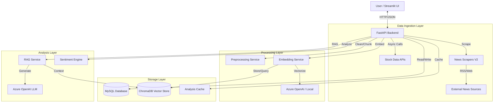
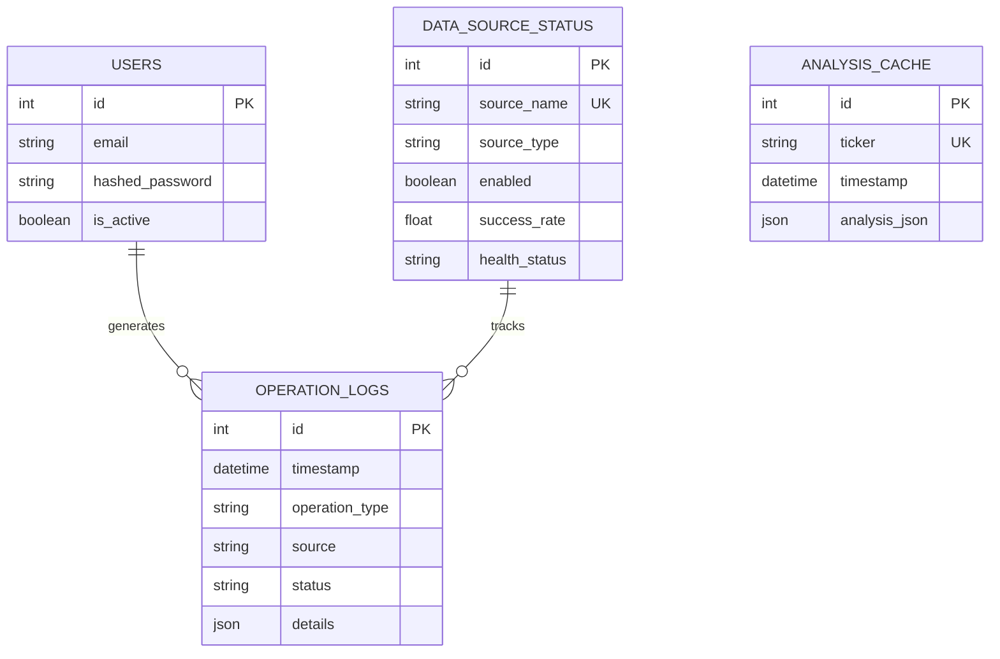
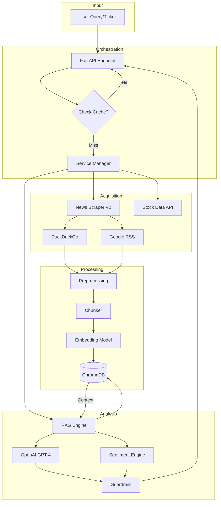
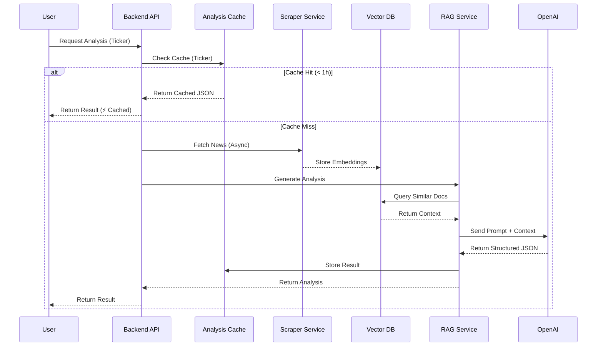

# AI Market Analysis System - Technical Documentation

## 1. Executive Summary

### 1.1 Problem Statement
Retail investors often struggle to aggregate and analyze scattered financial information from multiple sources (news sites, RSS feeds, stock APIs). Manual analysis is time-consuming, prone to bias, and lacks real-time synthesis of qualitative (news sentiment) and quantitative (price data) factors.

### 1.2 Solution
The **AI Market Analysis Assistant** is a comprehensive platform that automates the collection, processing, and analysis of financial data. It combines **Real-time Stock APIs**, **Intelligent Web Scraping**, and **Retrieval-Augmented Generation (RAG)** to provide actionable, AI-driven investment insights with strict guardrails and transparent sourcing.

---

## 2. High-Level Architecture (HLD)

The system follows a microservices-based architecture containerized with Docker.



---

## 3. Core Components

### 3.1 Data Ingestion (Scraper V2 & APIs)
- **Stock APIs**: Async integration with multiple providers (Finnhub, Alpha Vantage, Yahoo Finance, Marketstack) with priority-based fallback.
- **News Scrapers (V2)**: 
  - **DuckDuckGo News**: Primary aggregator for broad coverage.
  - **Google News RSS**: Fallback for specific topics.
  - **Architecture**: Factory pattern (`ScraperFactory`) loads scrapers dynamically from `sources.yaml`.
  - **Async Execution**: Parallel fetching to minimize latency.

### 3.2 Processing & Embeddings
- **Preprocessing**: Text cleaning, normalization, and chunking (recursive character splitter).
- **Embeddings**: Hybrid approach supporting both **Azure OpenAI** (`text-embedding-3-small`) and **Local** (HuggingFace) models.
- **Vector DB**: **ChromaDB** stores document embeddings with metadata (ticker, source, timestamp) for semantic retrieval.

### 3.3 RAG & Analysis Engine
- **RAG Service**: Retrieves relevant news chunks from ChromaDB based on user query.
- **OpenAI Analysis**: Uses `gpt-4` (or configured model) to synthesize retrieved context into structured insights.
- **Prompts**: Context-aware prompts enforce role (Financial Analyst), output format (JSON), and strict rules (No financial advice).
- **Sentiment Analysis**: Hybrid scoring using LLM-based classification (Bullish/Bearish/Neutral) with confidence weighting.

### 3.4 Guardrails
- **Prompt Guardrails**: System instructions preventing hallucination and enforcing objective tone.
- **Website Guardrails**: `robots.txt` compliance and domain allow/block lists.
- **Sentiment Guardrails**: Logic to prevent weak signals from overriding neutral majorities (e.g., requiring >0.4 score to override >50% neutral articles).

### 3.5 Caching System
- **Analysis Cache**: Stores full RAG analysis results for 1 hour.
- **Mechanism**: Checks `analysis_cache` table before triggering new scrapes.
- **Benefits**: Instant responses for repeated queries, reduced API costs.

---

## 4. Database Schema

### 4.1 MySQL Schema (Relational Data)

#### `users`
| Field | Type | Description |
|-------|------|-------------|
| id | Integer | Primary Key |
| email | String | Unique User Email |
| hashed_password | String | Auth Credential |
| is_active | Boolean | Account Status |

#### `operation_logs`
| Field | Type | Description |
|-------|------|-------------|
| id | Integer | Primary Key |
| timestamp | DateTime | Event Time |
| operation_type | String | scrape, api_call, analysis |
| source | String | Source Name |
| status | String | success, failure |
| duration_ms | Integer | Performance Metric |

#### `data_source_status`
| Field | Type | Description |
|-------|------|-------------|
| id | Integer | Primary Key |
| source_name | String | Unique Name |
| health_status | Derived | Healthy/Degraded/Unhealthy |
| success_rate | Float | Calculated Metric |
| last_success | DateTime | Timestamp |

#### `analysis_cache`
| Field | Type | Description |
|-------|------|-------------|
| id | Integer | Primary Key |
| ticker | String | Stock Symbol (Indexed) |
| timestamp | DateTime | Creation Time |
| analysis_json | JSON | Full Analysis Result |

### 4.3 Entity Relationship Diagram (ERD)



### 4.2 Vector DB Schema (ChromaDB)
- **Collection**: `stock_market_news`
- **Document**: Text chunk from news article.
- **Metadata**:
  - `ticker`: Stock symbol
  - `source`: Publisher name
  - `url`: Source URL
  - `timestamp`: Article date
  - `keywords`: Extracted tags

---

## 5. Low-Level Design (LLD) & Flows

### 5.1 Detailed Data Flow



### 5.2 Stock Analysis Sequence



### 5.2 Async API Integration
The system uses `asyncio` and `aiohttp` for non-blocking operations.

```python
# Conceptual Async Flow
async def fetch_stock_data(ticker):
    tasks = [api.fetch(ticker) for api in enabled_apis]
    for future in asyncio.as_completed(tasks):
        result = await future
        if result: return result # Return first success
```

---

## 6. Operational Details

### 6.1 Logging & Metrics
- **Operation Logs**: Every scrape, API call, and analysis is logged to MySQL.
- **Dashboard**: Streamlit "System Status" tab visualizes:
  - Scraper Health (Success Rate, Latency)
  - API Status
  - Error Logs (Recent failures with details)

### 6.2 Error Handling
- **Graceful Degradation**: If one API fails, the next priority API is used.
- **User Feedback**: Detailed error messages (e.g., "Marketstack failed for RELICAB: No data") instead of generic 500s.
- **Fallback**: If RAG fails, basic stock data is still returned.

### 6.3 Dashboard (Streamlit)
- **Tab 1: Analysis**: Search bar, Real-time charts, AI Insights, Sentiment Meter, References.
- **Tab 2: System Status**: Health checks, API testing tools, Logs viewer.
- **Tab 3: Documentation**: User guides and API references.

---

## 7. Future Roadmap
- **User Personalization**: Watchlists and alerts based on `users` table.
- **Advanced Charts**: Technical indicators (RSI, MACD) overlay.
- **Multi-Asset Support**: Crypto and Forex analysis.
