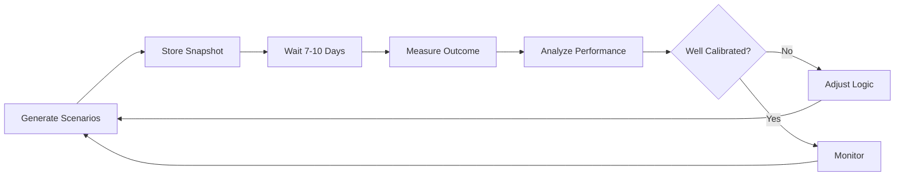

# BACKTESTING GUIDE

**Complete guide to scenario backtesting, outcome tracking, and performance calibration.**

---

## Overview

The backtesting system enables **measuring prediction accuracy** by tracking scenarios against realized market outcomes.

**Key Capabilities**:
- ✅ Store every scenario prediction with timestamp
- ✅ Update with realized outcomes later
- ✅ Measure accuracy by scenario type
- ✅ Identify calibration issues
- ✅ Generate tuning recommendations

---

## Architecture

```
Scenario Generation → Snapshot Storage → Wait Period → Outcome Measurement
                                                              ↓
                                     Performance Analysis ← Update Snapshot
                                                              ↓
                                              Calibration Recommendations
```

---

## Core Concepts

### 1. Scenario Snapshot

A complete capture of the analysis state at a specific moment:

```python
{
  "snapshot_id": "snapshot_RELIANCE_abc123",
  "timestamp": "2024-01-15T09:00:00Z",
  "ticker": "RELIANCE",
  
  # What we knew
  "market_state": {
    "trend_bias": "bullish",
    "confidence": 0.75,
    ...
  },
  "price_zones": {...},
  "scenarios": [
    {
      "id": "bull_continuation_v1_abc123",
      "probability": 0.675,
      ...
    }
  ],
  
  # Current price
  "price_at_snapshot": 1550.0,
  
  # What actually happened (filled later)
  "realized_outcome": None,
  "outcome_measured_at": None
}
```

### 2. Realized Outcome

What actually happened after the snapshot:

```python
{
  "activated_scenario_id": "bull_continuation_v1_abc123",
  "activation_time": "2024-01-17T10:30:00Z",
  "max_favorable_excursion": 1620.0,  # Highest price reached
  "max_adverse_excursion": 1540.0,    # Lowest price reached
  "final_price": 1610.0,
  "price_change_pct": 3.87,
  "days_elapsed": 7
}
```

### 3. Performance Metrics

How well scenarios predicted reality:

```python
{
  "activation_rates": {
    "bull": 0.60,  # Bull scenario happened 60% of time
    "base": 0.30,
    "bear": 0.10
  },
  "avg_predicted_probabilities": {
    "bull": 0.65,  # Average predicted probability
    "base": 0.25,
    "bear": 0.10
  },
  "calibration_error": {
    "bull": 0.05,  # Predicted 65%, actually 60% = 5% error
    "base": -0.05,
    "bear": 0.00
  },
  "accuracy_by_type": {
    "bull": 0.83,  # 83% accurate when predicting bull
    "base": 0.50,
    "bear": 1.0
  }
}
```

---

## STEP 1: Automatic Snapshot Storage

**When**: Every time scenarios are generated  
**Where**: `rag.py` Line 554-579

**Process**:
```python
from app.backtesting import store_snapshot

snapshot_id = store_snapshot(
    ticker=ticker,
    market_state=market_state,
    price_zones=price_zones,
    scenarios=scenarios,
    signal_conflicts=signal_conflicts,
    risk_score=risk_score,
    current_price=current_price
)

logger.info(f"📸 Stored snapshot: {snapshot_id}")
```

**Output**: Unique `snapshot_id` for tracking

---

## STEP 2: Outcome Measurement (Manual/Automated)

**When**: After sufficient time has passed (typically 5-10 days)

### Manual Process

```python
from app.backtesting import update_outcome

# Determine which scenario activated
# Example: Price broke above resistance → Bull scenario

update_outcome(
    snapshot_id="snapshot_RELIANCE_abc123",
    ticker="RELIANCE",
    activated_scenario_id="bull_continuation_v1_abc123",
    activation_time="2024-01-17T10:30:00Z",
    max_favorable_excursion=1620.0,
    max_adverse_excursion=1540.0,
    final_price=1610.0,
    days_elapsed=7
)
```

### Automated Process (Future)

```python
# Scheduled job (runs daily)
def update_snapshot_outcomes():
    """
    For each snapshot older than 7 days:
    1. Fetch price history since snapshot
    2. Determine which scenario activated
    3. Update snapshot with outcome
    """
    snapshots = get_snapshots_pending_outcome(days=7)
    
    for snapshot in snapshots:
        # Fetch price data
        prices = fetch_price_history(
            snapshot.ticker,
            start=snapshot.timestamp,
            end=now()
        )
        
        # Determine activation
        activated = determine_activated_scenario(
            scenarios=snapshot.scenarios,
            price_zones=snapshot.price_zones,
            prices=prices
        )
        
        # Update
        update_outcome(
            snapshot_id=snapshot.snapshot_id,
            ...
        )
```

---

## STEP 3: Performance Analysis

**When**: Monthly or on-demand

### Basic Analysis

```python
from app.backtesting import analyze_scenario_performance

performance = analyze_scenario_performance(
    ticker="RELIANCE",
    lookback_days=30
)

print(f"Overall Accuracy: {performance['overall_accuracy']:.1%}")
print(f"Total Snapshots: {performance['total_snapshots']}")

for rec in performance['recommendations']:
    print(f"  • {rec}")
```

### Example Output

```json
{
  "ticker": "RELIANCE",
  "lookback_days": 30,
  "total_snapshots": 20,
  
  "activation_rates": {
    "bull": 0.60,
    "base": 0.25,
    "bear": 0.15
  },
  
  "avg_predicted_probabilities": {
    "bull": 0.65,
    "base": 0.25,
    "bear": 0.10
  },
  
  "calibration_error": {
    "bull": 0.05,   // Over-predicting by 5%
    "base": 0.00,   // Perfect calibration
    "bear": -0.05   // Under-predicting by 5%
  },
  
  "accuracy_by_type": {
    "bull": 0.83,  // 10/12 correct
    "base": 0.60,  // 3/5 correct
    "bear": 1.00   // 3/3 correct
  },
  
  "overall_accuracy": 0.80,  // 16/20 most likely scenarios were correct
  
  "recommendations": [
    "✅ Bull scenarios well-calibrated (predicted 65%, actual 60%)",
    "⚠️ Bear scenarios under-predicted (increase probability slightly)",
    "✅ Overall accuracy 80% is acceptable"
  ]
}
```

---

## STEP 4: Calibration

**Based on performance data, adjust scenario engine logic.**

### Example: Bull Scenarios Over-Predicting

**Problem**:
```
Predicted bull probability: 65%
Actual bull activation: 55%
Error: +10% (over-predicting)
```

**Fix in `scenario_engine/generator.py`**:
```python
# Before
if trend_bias == "bullish" and confidence >= 0.7:
    bull_prob = 0.675
    base_prob = 0.25
    bear_prob = 0.075

# After (reduced bull, increased base)
if trend_bias == "bullish" and confidence >= 0.7:
    bull_prob = 0.60   # Reduced from 0.675
    base_prob = 0.32   # Increased from 0.25
    bear_prob = 0.08   # Adjusted to sum to 1.0
```

### Example: Base Scenarios Over-Predicting

**Problem**:
```
Predicted base probability: 25%
Actual base activation: 15%
Error: +10%
```

**Fix**:
```python
# Reduce base case probabilities across all bias types
# Redistribute to bull/bear appropriately
```

---

## DETERMINING SCENARIO ACTIVATION

### Rules for Activation

**Bull Scenario Activates If**:
- Price breaks above resistance zone
- Holds above value area for sustained period
- Triggers conditions met

**Base Scenario Activates If**:
- Price remains within value area
- No breakout above resistance or below support
- Range-bound behavior

**Bear Scenario Activates If**:
- Price breaks below support zone
- Sustained breakdown
- Triggers conditions met

**None Activate If**:
- Invalidation conditions met before triggers
- Extreme volatility prevents clear resolution

### Code Example

```python
def determine_activated_scenario(scenarios, price_zones, prices):
    """
    Determine which scenario activated based on price action.
    
    Args:
        scenarios: List of generated scenarios
        price_zones: Support/resistance/value zones
        prices: Price history since snapshot
        
    Returns:
        activated_scenario_id or None
    """
    max_price = prices.max()
    min_price = prices.min()
    final_price = prices[-1]
    
    resistance_upper = price_zones["resistance"]["upper"]
    support_lower = price_zones["support"]["lower"]
    value_lower = price_zones["value_area"]["lower"]
    value_upper = price_zones["value_area"]["upper"]
    
    # Check bull activation
    if max_price > resistance_upper:
        bull_scenario = [s for s in scenarios if s["type"] == "bull"][0]
        return bull_scenario["id"]
    
    # Check bear activation
    if min_price < support_lower:
        bear_scenario = [s for s in scenarios if s["type"] == "bear"][0]
        return bear_scenario["id"]
    
    # Check if stayed in range
    if value_lower <= final_price <= value_upper:
        base_scenario = [s for s in scenarios if s["type"] == "base"][0]
        return base_scenario["id"]
    
    return None  # No clear activation
```

---

## METRICS DEFINITIONS

### Activation Rate
```
activation_rate = (times_scenario_activated / total_snapshots)
```

### Predicted Probability
```
avg_predicted_prob = mean(scenario.probability for all snapshots)
```

### Calibration Error
```
calibration_error = activation_rate - avg_predicted_prob
```

**Interpretation**:
- **Positive error**: Over-predicting (reduce probability)
- **Negative error**: Under-predicting (increase probability)
- **Near zero**: Well-calibrated

### Accuracy
```
accuracy = (correct_predictions / total_predictions)

where correct = (most_likely_scenario == activated_scenario)
```

---

## EXAMPLE WORKFLOW

### Month 1: Initial Deployment

```python
# Week 1-4: Generate analyses
for day in range(20):
    analysis = generate_analysis("RELIANCE")
    # Snapshots stored automatically
    
# Total: 20 snapshots stored
```

### Month 2: First Measurement

```python
# Day 35: Update outcomes
for snapshot in get_snapshots_older_than(days=7):
    outcome = measure_outcome(snapshot)
    update_outcome(snapshot.id, outcome)

# Analyze
performance = analyze_scenario_performance("RELIANCE", 30)

# Result:
# Bull predicted: 65%, Actual: 55% → Reduce bull prob
# Base predicted: 25%, Actual: 35% → Increase base prob
```

### Month 2: Calibration

```python
# Adjust scenario_engine/generator.py
# Deploy updated logic
```

### Month 3: Validation

```python
# Generate new snapshots with adjusted logic
# After 30 days, re-analyze

performance = analyze_scenario_performance("RELIANCE", 30)

# Result:
# Bull predicted: 58%, Actual: 57% → Improved!
# Base predicted: 32%, Actual: 33% → Improved!
```

---

## STORAGE ARCHITECTURE

### Current (MVP)

**In-Memory**:
```python
_snapshot_storage: Dict[str, List[ScenarioSnapshot]] = {}

# Snapshots stored in Python dict
# Cleared on application restart
```

**Limitations**:
- Lost on restart
- No persistence
- Limited to single server

### Future (Production)

**PostgreSQL**:
```sql
CREATE TABLE scenario_snapshots (
    snapshot_id VARCHAR PRIMARY KEY,
    ticker VARCHAR,
    timestamp TIMESTAMP,
    market_state JSONB,
    price_zones JSONB,
    scenarios JSONB,
    price_at_snapshot FLOAT,
    realized_outcome JSONB,
    outcome_measured_at TIMESTAMP
);

CREATE INDEX ON scenario_snapshots(ticker, timestamp);
```

**Benefits**:
- Persistent storage
- Query historical snapshots
- Multi-server support
- Data integrity

---

## EXPORT & ANALYSIS

### Export to JSON

```python
from app.backtesting import export_snapshots_to_json

export_snapshots_to_json(
    ticker="RELIANCE",
    filepath="/tmp/reliance_snapshots.json"
)
```

### Load in Jupyter Notebook

```python
import json
import pandas as pd

with open("/tmp/reliance_snapshots.json") as f:
    data = json.load(f)

snapshots = data["snapshots"]

# Convert to DataFrame
df = pd.DataFrame([
    {
        "timestamp": s["timestamp"],
        "bull_prob": [sc for sc in s["scenarios"] if sc["type"]=="bull"][0]["probability"],
        "activated": s["realized_outcome"]["activated_scenario_id"] if s["realized_outcome"] else None
    }
    for s in snapshots
])

# Analyze
df["bull_activated"] = df["activated"].str.contains("bull")
df.groupby("bull_activated")["bull_prob"].mean()
```

---

## ADVANCED ANALYSIS

### Time-to-Activation

```python
def calculate_time_to_activation(snapshots):
    """
    How long does it take for scenarios to activate?
    """
    times = []
    for s in snapshots:
        if s.realized_outcome:
            snapshot_time = parse_time(s.timestamp)
            activation_time = parse_time(s.realized_outcome["activation_time"])
            days = (activation_time - snapshot_time).days
            times.append(days)
    
    return {
        "avg_days": np.mean(times),
        "median_days": np.median(times),
        "min_days": min(times),
        "max_days": max(times)
    }
```

### Scenario Transition Matrix

```python
def build_transition_matrix(snapshots):
    """
    What scenario activates for each prediction?
    
    Example:
              Actual
           Bull Base Bear
    Pred
    Bull   80%  15%  5%
    Base   30%  60%  10%
    Bear   10%  20%  70%
    """
```

---

## CONTINUOUS IMPROVEMENT LOOP



**Frequency**:
- Performance analysis: Monthly
- Calibration adjustments: Quarterly
- Monitoring: Continuous

---

## KNOWN LIMITATIONS

1. **In-Memory Storage** - MVP only, needs DB
2. **Manual Outcome Updates** - Automation planned
3. **Simple Activation Logic** - Could be more sophisticated
4. **Limited Historical Data** -Needs time to accumulate
5. **Single-Ticker Focus** - Portfolio-level backtesting future

---

## BEST PRACTICES

1. **Wait Sufficient Time** - Allow 7-10 days before measuring outcomes
2. **Regular Analysis** - Monthly performance reviews
3. **Gradual Adjustments** - Small calibration changes (5-10% max)
4. **Document Changes** - Log all scenario engine modifications
5. **A/B Testing** - Test changes on subset before full deployment

---

## SUMMARY

**Backtesting enables**:
- ✅ Objective measurement of prediction accuracy
- ✅ Data-driven calibration of scenario engine
- ✅ Continuous improvement of probability estimates
- ✅ Trust building through validated performance

**This transforms the system from "AI guessing" to "statistically validated prediction engine."**
