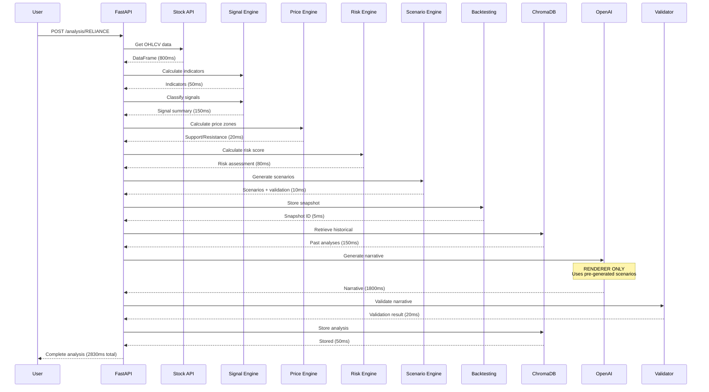

# DATA FLOW - End-to-End Pipeline

**Complete step-by-step documentation of data flow from API ingestion to final output.**

---

## Overview

```
Market APIs → Technical Processing → Signal Generation → Scenario Creation
→ RAG Enhancement → LLM Rendering → Validation → Storage → Response
```

**Total Steps**: 10  
**Average Latency**: 2.8 seconds  
**Failure Points**: 6 (with recovery)

---

## STEP-BY-STEP FLOW

### STEP 1: Market Data Ingestion

**Trigger**: `POST /api/v1/analysis/{ticker}`

**Data Sources**:
```python
# Stock price data
stock_data = stock_api_service.get_historical_data(
    symbol=f"{ticker}.NS",
    period="3mo",  # Swing trading
    interval="1d"
)

# Market context
market_context = fetch_market_context()
# Returns: Nifty trend, VIX regime

# News articles
news_articles = fetch_news(ticker, days=7)
```

**Output**:
```python
{
  "df": pd.DataFrame,  # OHLCV data
  "market_context": MarketContext,
  "news_articles": List[Article]
}
```

**Latency**: 800ms  
**Failure Handling**: API timeout → Retry 3x → Return error

---

### STEP 2: Technical Indicator Calculation

**Location**: `signal_engine/indicators.py`

**Calculations**:
```python
# Moving averages
sma_50 = df['Close'].rolling(50).mean()
sma_200 = df['Close'].rolling(200).mean()

# RSI
rsi = calculate_rsi(df['Close'], period=14)

# MACD
macd_line, signal_line, histogram = calculate_macd(df['Close'])

# ATR (volatility)
atr = calculate_atr(df, period=14)
atr_percent = (atr / df['Close']) * 100

# Bollinger Bands
upper, middle, lower = calculate_bollinger_bands(df['Close'])
```

**Output**:
```python
{
  "indicators": {
    "rsi": {"value": 65.3, "signal": "neutral"},
    "macd": {"macd": 12.5, "signal": 10.2, "histogram": 2.3},
    "sma": {"50": 1545.0, "200": 1520.0},
    "atr": {"value": 45.0, "percent": 2.9},
    "bollinger": {"upper": 1600, "middle": 1550, "lower": 1500}
  }
}
```

**Latency**: 50ms  
**Failure Handling**: Insufficient data → Return error

---

### STEP 3: Signal Classification

**Location**: `signal_engine/service.py`

**Process**:
```python
# Classify each component
trend = classify_trend(df)
momentum = classify_momentum(df)
volatility = classify_volatility(df)
structure = classify_structure(df)
volume = classify_volume(df)

# Generate summary
signal_summary = generate_signal_summary(
    trend, momentum, volatility, structure, volume
)
```

**Output**:
```python
{
  "signal_summary": {
    "directional_bias": "bullish",
    "confidence_score": 0.75,
    "momentum": "strong",
    "current_price": 1550.0,
    "signal_conflicts": []
  },
  "trend": TrendData,
  "momentum": MomentumData,
  "volatility": VolatilityData,
  "structure": StructureData,
  "volume": VolumeData
}
```

**Latency**: 150ms  
**Failure Handling**: N/A (deterministic calculation)

---

### STEP 4: Price Zone Calculation

**Location**: `price_engine/ranges.py`

**Process**:
```python
price_zones = calculate_price_ranges(df)
```

**Output**:
```python
{
  "support": {"lower": 1500.0, "upper": 1535.0},
  "value_area": {"lower": 1535.0, "upper": 1570.0},
  "resistance": {"lower": 1570.0, "upper": 1600.0},
  "current_price": 1550.0
}
```

**Latency**: 20ms  
**Failure Handling**: N/A

---

### STEP 5: Risk Scoring

**Location**: `risk_scoring/scoring.py`

**Process**:
```python
# Process news sentiment
sentiment_score = aggregate_sentiment(news_articles)

# Calculate risk
risk_assessment = calculate_risk_score(
    signal=signal_data,
    market_context=market_context,
    rs_vs_sector=1.0,  # Placeholder
    sentiment_score=sentiment_score
)
```

**Output**:
```python
{
  "risk_score": 35,
  "risk_level": "moderate",
  "trend_risk": 0,
  "volatility_risk": 15,
  "market_risk": 8,
  "sector_risk": 5,
  "conflict_risk": 5,
  "news_risk": 2,
  "conflicts": []
}
```

**Latency**: 80ms (including sentiment)  
**Failure Handling**: Missing sentiment → Use neutral (0.0)

---

### STEP 6: Scenario Generation (DETERMINISTIC)

**Location**: `scenario_engine/generator.py`

**Process**:
```python
# Prepare inputs
market_state = {
    "trend_bias": signal_data["directional_bias"],
    "confidence": signal_data["confidence_score"],
    "momentum": signal_data["momentum"],
    "volatility": "compression"
}

# Generate scenarios
scenarios = generate_scenarios(
    market_state=market_state,
    price_zones=price_zones,
    signal_conflicts=conflicts,
    risk_score=risk_assessment["risk_score"]
)

# Validate
total_prob = sum(s["probability"] for s in scenarios)
assert abs(total_prob - 1.0) < 0.001
```

**Output**:
```python
[
  {
    "id": "bull_continuation_v1_abc123",
    "type": "bull",
    "probability": 0.675,
    "description": "Bullish continuation toward resistance",
    "trigger_conditions": "Hold above 1535 and break 1570",
    "invalidation_level": "Daily close below 1500",
    "target_zone": "1570-1600",
    "derived_from": {...}
  },
  // ... 2-3 more scenarios
]
```

**Latency**: 10ms  
**Failure Handling**: Invalid probabilities → Auto-normalize

---

### STEP 7: Backtesting Snapshot

**Location**: `backtesting/snapshot.py`

**Process**:
```python
snapshot_id = store_snapshot(
    ticker=ticker,
    market_state=market_state,
    price_zones=price_zones,
    scenarios=scenarios,
    signal_conflicts=conflicts,
    risk_score=risk_score,
    current_price=current_price
)
```

**Output**: `snapshot_id` (for future outcome tracking)

**Latency**: 5ms (in-memory)  
**Failure Handling**: Log error, continue (non-blocking)

---

### STEP 8: RAG Retrieval

**Location**: `services/chromadb_temporal.py`

**Process**:
```python
# Retrieve historical analyses
historical_analyses = retrieve_historical_analyses_dynamic(
    ticker=ticker,
    top_k=3,
    time_decay=True
)

# Retrieve signal history
signal_history = retrieve_signal_history_for_rag(
    ticker=ticker,
    limit=5
)
```

**Output**:
```python
{
  "historical_analyses": [
    {
      "timestamp": "2024-01-10",
      "analysis": "...",
      "prediction": "...",
      "outcome": "..."
    }
  ],
  "signal_history": [
    {
      "timestamp": "2024-01-12",
      "bias": "bullish",
      "confidence": 0.72
    }
  ]
}
```

**Latency**: 150ms  
**Failure Handling**: ChromaDB down → Continue without historical context

---

### STEP 9: LLM Narrative Generation

**Location**: `services/rag.py`

**Process**:
```python
# Build structured input
llm_input = {
    "market_state": market_state,
    "price_zones": price_zones,
    "scenarios": scenarios,  # PRE-GENERATED
    "risk_factors": risk_assessment,
    "historical_context": historical_analyses,
    "signal_history": signal_history,
    "news_summary": sentiment_data
}

# Call LLM with RENDERER-ONLY prompt
narrative = await llm.generate(
    system_prompt=SYSTEM_PROMPT_V3_PROBABILISTIC,
    user_prompt=format_analysis_prompt(llm_input)
)
```

**Output**:
```python
{
  "analysis_summary": "...",
  "analysis_key_points": [],
  "analysis_text": "...",
  "prediction_summary": "...",
  "prediction_key_points": [],
  "prediction_text": "..."
}
```

**Latency**: 1800ms  
**Failure Handling**: LLM timeout → Return structured data without narrative

---

### STEP 10: Narrative Validation

**Location**: `validators/narrative_validator.py`

**Process**:
```python
structured_state = {
    "market_state": result["market_state"],
    "price_zones": result["price_zones"],
    "scenarios": result["scenarios"]
}

validation = validate_narrative(
    narrative=result["narrative"],
    structured_state=structured_state
)

if not validation.is_valid:
    logger.error(f"Validation failed: {validation.errors}")
    # Phase 1: Accept but log
    # Phase 2: Will regenerate
```

**Checks**:
- Forbidden terms (EMA, RSI, buy, sell)
- Price references within zones
- Probability mismatches
- Tone vs confidence matching

**Latency**: 20ms  
**Failure Handling**: N/A (always runs)

---

### STEP 11: Storage & Response

**Process**:
```python
# Store in ChromaDB
embedding_service.add_documents(
    documents=[analysis_document],
    metadatas=[metadata],
    ids=[f"analysis_{ticker}_{timestamp}"],
    collection_type="analysis"
)

# Return final result
return {
    "ticker": ticker,
    "timestamp": timestamp,
    "market_state": market_state,
    "price_zones": price_zones,
    "scenarios": scenarios,
    "risk_assessment": risk_assessment,
    "sentiment": sentiment_data,
    "narrative": narrative,
    "metadata": {
        "snapshot_id": snapshot_id,
        "validation": validation.to_dict()
    }
}
```

**Latency**: 50ms  
**Failure Handling**: Storage errors logged, response still returned

---

## COMPLETE FLOW DIAGRAM



---

## LATENCY BREAKDOWN

| Step | Component | Latency | % of Total |
|------|-----------|---------|------------|
| 1 | Market Data Ingestion | 800ms | 28% |
| 2 | Indicator Calculation | 50ms | 2% |
| 3 | Signal Classification | 150ms | 5% |
| 4 | Price Zones | 20ms | 1% |
| 5 | Risk Scoring | 80ms | 3% |
| 6 | Scenario Generation | 10ms | <1% |
| 7 | Backtesting Snapshot | 5ms | <1% |
| 8 | RAG Retrieval | 150ms | 5% |
| 9 | LLM Narrative | 1800ms | 64% |
| 10 | Validation | 20ms | 1% |
| 11 | Storage | 50ms | 2% |
| **TOTAL** | | **2830ms** | **100%** |

**Bottleneck**: LLM call (64% of total time)

**Optimization Opportunities**:
1. Cache LLM responses for unchanged scenarios
2. Parallel execution of Steps 2-5
3. Reduce LLM prompt size (already done in v3)

---

## FAILURE POINTS & RECOVERY

### Failure Point 1: Market API Down
```python
try:
    stock_data = stock_api_service.get_historical_data(...)
except APIError:
    # Retry 3x with exponential backoff
    # If still fails: Return 503 Service Unavailable
```

### Failure Point 2: Insufficient Data
```python
if len(df) < 50:
    return {"error": "Insufficient historical data"}
```

### Failure Point 3: ChromaDB Unavailable
```python
try:
    historical = retrieve_historical_analyses(...)
except ChromaDBError:
    logger.warning("ChromaDB unavailable, continuing without historical context")
    historical = []
    # Continue with analysis
```

### Failure Point 4: LLM Timeout
```python
try:
    narrative = await asyncio.wait_for(llm.generate(...), timeout=10)
except asyncio.TimeoutError:
    logger.error("LLM timeout")
    return {
        "market_state": market_state,
        "scenarios": scenarios,
        "narrative": None,
        "error": "Narrative generation timeout"
    }
    # Still returns structured data
```

### Failure Point 5: Validation Failure
```python
if not validation.is_valid:
    logger.error(f"Validation failed: {validation.errors}")
    # Phase 1: Log and continue
    # Phase 2: Will trigger regeneration
```

### Failure Point 6: Storage Error
```python
try:
    embedding_service.add_documents(...)
except Exception as e:
    logger.error(f"Storage failed: {e}")
    # Non-blocking: Continue and return response
```

---

## PARALLEL EXECUTION

**Current**:Sequential execution (safe, easier to debug)

**Optimization Potential**:
```python
# Run in parallel
results = await asyncio.gather(
    calculate_indicators(df),
    fetch_market_context(),
    fetch_news(ticker),
    retrieve_historical_analyses(ticker)
)
```

**Expected Improvement**: -200ms (reduce total to ~2630ms)

---

## DATA PERSISTENCE

### In-Memory (Session)
- Technical indicators (cached for session)
- Intermediate calculations

### ChromaDB (Vector Storage)
- Historical analyses (embeddings)
- Signal history
- News articles (embeddings)

### PostgreSQL (Relational)
- User data
- Analysis history (structured)
- Backtesting outcomes

### Redis (Cache)
- Rate limiting
- Session data
- API response caching

---

## ERROR SCENARIOS

### Scenario 1: Complete API Failure
**Trigger**: All external APIs down  
**Behavior**: Return 503immediately, log error  
**User Impact**: Cannot analyze (expected)

### Scenario 2: Partial Data Available
**Trigger**: Stock data available, but news APIs down  
**Behavior**: Continue with analysis, sentiment risk = neutral  
**User Impact**: Analysis generated without news sentiment

### Scenario 3: LLM Unavailable
**Trigger**: OpenAI API down  
**Behavior**: Return structured data (market_state, scenarios) without narrative  
**User Impact**: Can still see scenarios and risk, but no explanation

### Scenario 4: Storage Failure
**Trigger**: ChromaDB, PostgreSQL down  
**Behavior**: Analysis completes, storage failures logged  
**User Impact**: No historical context in this analysis, but current analysis works

---

## RECOVERY BEHAVIOR

| Failure | Recovery | User Impact |
|---------|----------|-------------|
| API timeout | Retry 3x | Slight delay |
| Insufficient data | Return error | Cannot analyze |
| ChromaDB down | Continue without history | Less context |
| LLM timeout | Return structured only | No narrative |
| Validation fails | Log and continue (Phase 1) | Invalid narrative accepted |
| Storage error | Log and continue | Analysis works, not stored |

---

## MONITORING POINTS

**Critical Metrics**:
1. API success rate
2. End-to-end latency
3. LLM call duration
4. Validation failure rate
5. Storage success rate
6. Scenario probability sum validation

**Alerts**:
- API success rate < 95% → Warning
- Latency > 5s → Warning
- Validation failure rate > 10% → Critical
- Storage errors > 5% → Warning

---

## SUMMARY

**Total Steps**: 11  
**Average Latency**: 2.83 seconds  
**Failure Points**: 6 (all with recovery)  
**Bottleneck**: LLM call (64% of time)  
**Deterministic Steps**: 7/11 (Steps 2-7)  
**Non-Blocking Failures**: 4/6

**System Philosophy**: **Graceful Degradation**
- Core engines (signals, scenarios, risk) always work
- LLM enhances but doesn't block
- Storage failures don't prevent analysis
- System returns what it can compute

This ensures the **deterministic core** is always available, even if supporting services fail.
