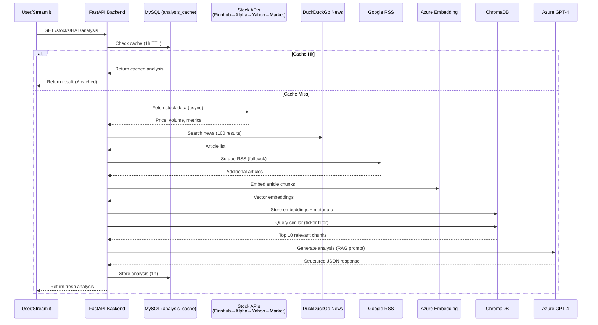

# External API Integration Guide

## Overview
This document maps all external APIs used in the Stock Market Analysis system, their purpose, implementation location, and usage.

---

## 1. Azure OpenAI APIs

### 1.1 GPT-4 (Text Generation)
**Purpose**: RAG-based stock analysis and prediction generation

**Used In**:
- `backend/app/services/rag.py` → `_generate_llm_response()`
- `backend/app/services/sentiment.py` → `analyze_sentiment()`

**Endpoint**: 
```
https://{your-resource}.openai.azure.com/openai/deployments/{deployment-name}/chat/completions
```

**Configuration**:
```python
# Environment Variables
AZURE_OPENAI_API_KEY=your_key
AZURE_OPENAI_ENDPOINT=https://your-resource.openai.azure.com/
AZURE_OPENAI_DEPLOYMENT=gpt-4
AZURE_OPENAI_API_VERSION=2024-02-15-preview
```

**Request Example**:
```python
response = client.chat.completions.create(
    model=settings.AZURE_OPENAI_DEPLOYMENT,
    messages=[
        {"role": "system", "content": "You are a financial analyst..."},
        {"role": "user", "content": prompt}
    ],
    temperature=0.5,
    response_format={"type": "json_object"}
)
```

**Usage Context**:
1. **Stock Analysis** (`rag.py`):
   - Takes retrieved news context from ChromaDB
   - Generates structured JSON with:
     - Summary (3-4 paragraphs)
     - Reasoning (key drivers)
     - Prediction (forward-looking outlook)
     - Risk factors
     - Key insights

2. **Sentiment Analysis** (`sentiment.py`):
   - Analyzes individual news articles
   - Returns: Bullish/Bearish/Neutral classification
   - Confidence score (0-1)

**Cost Optimization**:
- Analysis results cached for 1 hour
- Only processes top 10 relevant articles
- Uses `response_format={"type": "json_object"}` for structured output

---

### 1.2 Text Embedding (all-MiniLM-L6-v2) - **FREE**
**Purpose**: Convert text to vector embeddings for semantic search

**Used In**:
- `backend/app/services/embeddings.py` → `EmbeddingService`

**Model**: Local SentenceTransformers (Hugging Face)
```
Model: all-MiniLM-L6-v2
Dimensions: 384
Cost: FREE (local inference)
Latency: 10-50ms per text
```

**Configuration**:
```python
# No API key required - runs locally
from sentence_transformers import SentenceTransformer

model = SentenceTransformer('all-MiniLM-L6-v2')
```

**Request Example**:
```python
from app.services.embeddings import embedding_service

# Single embedding
embedding = embedding_service.generate_embedding("TCS reports strong Q3 earnings")
# Output: [0.123, -0.456, ..., 0.234]  # 384 dimensions

# Batch embeddings
embeddings = embedding_service.generate_embeddings_batch([
    "Article 1 text...",
    "Article 2 text..."
])
```

**Usage Context**:
1. **News Article Indexing**:
   - Called after scraping articles
   - Chunks text into 512-token segments
   - Generates embeddings locally (CPU)
   - Stores in ChromaDB with metadata

2. **Query Search**:
   - Embeds user query/ticker locally
   - Performs cosine similarity search in ChromaDB
   - Returns top 10 most relevant article chunks

3. **Historical Analysis Storage**:
   - Embeds analysis results for future retrieval
   - Enables semantic comparison of past analyses

**Why Local Model?**
- ✅ **FREE** - No API costs ($0 vs $0.0001/1K tokens)
- ✅ **Fast** - Local inference (10-50ms)
- ✅ **Privacy** - No data sent to external APIs
- ✅ **Unlimited** - No rate limits
- ✅ **Quality** - Comparable to text-embedding-ada-002 for most tasks

---

## 2. Stock Data APIs

### 2.1 Finnhub API
**Purpose**: Real-time stock price data, volume, and market metrics

**Used In**:
- `backend/app/services/stock_api_service.py` → `_fetch_from_finnhub()`

**Endpoint**:
```
https://finnhub.io/api/v1/quote?symbol={ticker}&token={api_key}
```

**Configuration**:
```python
FINNHUB_API_KEY=your_key
```

**Request Example**:
```python
import requests
response = requests.get(
    f"https://finnhub.io/api/v1/quote",
    params={
        "symbol": ticker,
        "token": settings.FINNHUB_API_KEY
    }
)
```

**Response Structure**:
```json
{
  "c": 4250.50,  // Current price
  "h": 4300.00,  // High
  "l": 4180.00,  // Low
  "o": 4200.00,  // Open
  "pc": 4200.00, // Previous close
  "t": 1701734400
}
```

**Usage Context**:
- Priority: **#1** (First API tried)
- Best for: US stocks, some international stocks
- Called via `/stocks/{ticker}/data` endpoint
- Async implementation with timeout (10s)

**Mapping Logic** (`stock_api_service.py:_fetch_from_finnhub()`):
```python
return {
    "ticker": ticker,
    "current_price": data['c'],
    "previous_close": data['pc'],
    "day_high": data['h'],
    "day_low": data['l'],
    "provider": "Finnhub"
}
```

---

### 2.2 Alpha Vantage API
**Purpose**: Comprehensive stock data with historical prices

**Used In**:
- `backend/app/services/stock_api_service.py` → `_fetch_from_alpha_vantage()`

**Endpoint**:
```
https://www.alphavantage.co/query?function=GLOBAL_QUOTE&symbol={ticker}&apikey={api_key}
```

**Configuration**:
```python
ALPHA_VANTAGE_API_KEY=your_key
```

**Request Example**:
```python
response = requests.get(
    "https://www.alphavantage.co/query",
    params={
        "function": "GLOBAL_QUOTE",
        "symbol": ticker,
        "apikey": settings.ALPHA_VANTAGE_API_KEY
    }
)
```

**Response Structure**:
```json
{
  "Global Quote": {
    "01. symbol": "HAL",
    "05. price": "4250.50",
    "08. previous close": "4200.00",
    "03. high": "4300.00",
    "04. low": "4180.00",
    "06. volume": "1500000"
  }
}
```

**Usage Context**:
- Priority: **#2** (Fallback if Finnhub fails)
- Best for: Global stocks, more data points
- Rate limit: 5 requests/minute (free tier)

**Mapping Logic**:
```python
quote = data['Global Quote']
return {
    "ticker": ticker,
    "current_price": float(quote['05. price']),
    "previous_close": float(quote['08. previous close']),
    "day_high": float(quote['03. high']),
    "day_low": float(quote['04. low']),
    "volume": int(quote['06. volume']),
    "provider": "Alpha Vantage"
}
```

---

### 2.3 Yahoo Finance API (yahooquery)
**Purpose**: Comprehensive stock data with historical trends

**Used In**:
- `backend/app/services/stock_api_service.py` → `_fetch_from_yahoo()`

**Library**: `yahooquery` (Python wrapper)

**Configuration**:
```python
# No API key required
from yahooquery import Ticker
```

**Request Example**:
```python
ticker_obj = Ticker(ticker)
data = ticker_obj.price[ticker]
```

**Response Fields**:
```python
{
    'regularMarketPrice': 4250.50,
    'regularMarketPreviousClose': 4200.00,
    'regularMarketDayHigh': 4300.00,
    'regularMarketDayLow': 4180.00,
    'regularMarketVolume': 1500000,
    'currency': 'INR',
    'exchangeName': 'NSE'
}
```

**Usage Context**:
- Priority: **#3** (Fallback after Alpha Vantage)
- Best for: Indian stocks with `.NS` or `.BO` suffix
- Free, no API key required
- More comprehensive historical data support

**Special Handling**:
- Automatically appends `.NS` for NSE stocks
- Example: `HAL` → `HAL.NS`

---

### 2.4 Marketstack API
**Purpose**: Real-time and historical stock market data

**Used In**:
- `backend/app/services/stock_api_service.py` → `_fetch_from_marketstack()`

**Endpoint**:
```
http://api.marketstack.com/v1/eod/latest?access_key={api_key}&symbols={ticker}
```

**Configuration**:
```python
MARKETSTACK_API_KEY=your_key
```

**Request Example**:
```python
response = requests.get(
    "http://api.marketstack.com/v1/eod/latest",
    params={
        "access_key": settings.MARKETSTACK_API_KEY,
        "symbols": ticker
    }
)
```

**Response Structure**:
```json
{
  "data": [
    {
      "close": 4250.50,
      "high": 4300.00,
      "low": 4180.00,
      "open": 4200.00,
      "volume": 1500000,
      "symbol": "HAL"
    }
  ]
}
```

**Usage Context**:
- Priority: **#4** (Last fallback)
- Best for: US and European stocks
- Limited support for Indian stocks
- Free tier: 100 requests/month

**Limitations**:
- May not support all Indian stocks
- Often returns 404 for NSE/BSE tickers

---

## 3. News Scraping APIs

### 3.1 DuckDuckGo News Search
**Purpose**: Primary news aggregator for stock-related articles

**Used In**:
- `backend/app/services/data_ingestion.py` → `fetch_news_for_ticker()`

**Library**: `duckduckgo_search`

**Implementation**:
```python
from duckduckgo_search import DDGS

ddgs = DDGS()
results = ddgs.news(
    keywords=f"{ticker} stock",
    max_results=100,
    region='in-en'  # India English
)
```

**Response Structure**:
```python
[
    {
        'title': 'HAL wins defense contract',
        'url': 'https://...',
        'source': 'Economic Times',
        'date': '2025-12-04',
        'body': 'Article excerpt...'
    }
]
```

**Usage Context**:
- **Primary source** for news articles
- Aggregates from 100+ news sources
- Domain diversity built-in
- No API key required
- Hardcoded in `data_ingestion.py` (not in `sources.yaml`)

**Advantages**:
- Free, unlimited
- Real-time news
- Broad coverage
- Automatic deduplication

---

### 3.2 Google News RSS
**Purpose**: Fallback news source for specific topics

**Used In**:
- `backend/app/scrapers/rss_scraper.py` → `RSSScraper.scrape()`

**Endpoint Pattern**:
```
https://news.google.com/rss/search?q={query}&hl=en-IN&gl=IN&ceid=IN:en
```

**Configuration** (`sources.yaml`):
```yaml
news_scrapers:
  - name: "Google News RSS"
    type: rss
    enabled: true
    base_url: "https://news.google.com/rss/search"
    rss_config:
      search_params:
        q: "{query} stock"
        hl: "en-IN"
        gl: "IN"
        ceid: "IN:en"
```

**Implementation**:
```python
import feedparser

url = f"https://news.google.com/rss/search?q={ticker}+stock"
feed = feedparser.parse(url)

for entry in feed.entries:
    article = {
        'title': entry.title,
        'url': entry.link,
        'published': entry.published,
        'source': entry.source.title
    }
```

**Usage Context**:
- **Fallback source** if DuckDuckGo has issues
- Configured in `sources.yaml`
- Loadable via `ScraperFactory`
- RSS feed parsing via `feedparser`

**RSS Feed Structure**:
```xml
<rss>
  <channel>
    <item>
      <title>HAL stock surges...</title>
      <link>https://...</link>
      <pubDate>Wed, 04 Dec 2025 10:00:00 GMT</pubDate>
      <source>Economic Times</source>
      <description>Article excerpt...</description>
    </item>
  </channel>
</rss>
```

---

## 4. Database APIs

### 4.1 ChromaDB (Vector Database)
**Purpose**: Store and query embeddings for semantic search (news + historical analyses)

**Used In**:
- `backend/app/services/embeddings.py` → `EmbeddingService`
- `backend/app/services/rag.py` → Historical analysis retrieval

**Configuration**:
```python
# Local persistent storage
CHROMA_PERSIST_DIR = "/app/data/chroma_db"
CHROMA_DB_PATH = "~/chroma_data"  # Docker volume mount
```

**Implementation**:
```python
import chromadb
from chromadb.config import Settings as ChromaSettings

client = chromadb.PersistentClient(
    path=settings.CHROMA_DB_PATH,
    settings=ChromaSettings(anonymized_telemetry=False)
)

# Collection 1: News articles
news_collection = client.get_or_create_collection(
    name="stock_news",
    metadata={"description": "Stock market news articles"}
)

# Collection 2: Historical analyses (NEW)
analysis_collection = client.get_or_create_collection(
    name="stock_analysis",
    metadata={"description": "Historical stock analyses"}
)
```

**Operations**:

**Collection 1: stock_news (News Articles)**

1. **Add News Documents**:
```python
news_collection.add(
    documents=["Article text chunk..."],
    embeddings=[[0.1, 0.2, ...]], # 384-dim
    metadatas=[{
        "ticker": "HAL",
        "source": "Economic Times",
        "url": "https://...",
        "timestamp": "2025-12-11T10:00:00",
        "keywords": "defense,contract,aerospace"
    }],
    ids=["unique-id-123"]
)
```

2. **Query Similar News**:
```python
results = news_collection.query(
    query_embeddings=[[0.1, 0.2, ...]],
    n_results=10,
    where={"ticker": "HAL"}  # Metadata filter
)
# Returns: documents, metadatas, distances, ids
```

**Collection 2: stock_analysis (Historical Analyses) - NEW**

1. **Store Analysis for Future Retrieval**:
```python
analysis_collection.add(
    documents=[full_analysis_text],
    embeddings=[[...]],  # 384-dim
    metadatas=[{
        "type": "historical_analysis",
        "ticker": "TCS",
        "timestamp": "2025-12-11T15:30:00",
        "sentiment_classification": "Bullish",
        "sentiment_score": 0.75,
        "prediction_direction": "Bullish",
        "confidence": 0.85,
        "price": 3188.50,
        "rsi": 65.2,
        "macd_trend": "Bullish",
        "bb_position": "Upper Band",
        "risk_factors": json.dumps([...]),
        "key_insights": json.dumps([...])
    }],
    ids=[f"analysis_TCS_{timestamp}"]
)
```

2. **Retrieve Historical Analyses**:
```python
results = analysis_collection.get(
    where={
        "$and": [
            {"type": "historical_analysis"},
            {"ticker": "TCS"}
        ]
    },
    limit=5
)
# Used for comparing current vs past state (synthesis mode)
```

**Usage Context**:
- **News collection**: Stores all processed news articles as vectors
- **Analysis collection**: **NEW** - Stores generated analyses for historical synthesis
- Enables semantic search (not just keyword matching)
- Filters by ticker, source, date, type
- Returns top-N most relevant for RAG context
- **Historical synthesis**: Compares current state vs past analyses

**Collection Schemas**:

```python
# stock_news collection
{
    "name": "stock_news",
    "metadata": {
        "ticker": "Stock symbol",
        "source": "Publisher name",
        "url": "Article URL",
        "timestamp": "ISO datetime",
        "keywords": "Extracted keywords"
    },
    "embedding": [384 dimensions],  # Local model
    "document": "Text chunk (512 tokens)"
}

# stock_analysis collection (NEW)
{
    "name": "stock_analysis",
    "metadata": {
        "type": "historical_analysis",
        "ticker": "Stock symbol",
        "timestamp": "ISO datetime",
        "sentiment_classification": "Bullish/Bearish/Neutral",
        "sentiment_score": 0.75,
        "prediction_direction": "Bullish/Bearish/Neutral",
        "confidence": 0.85,
        "price": 3188.50,
        "rsi": 65.2,
        "macd_trend": "Bullish",
        "bb_position": "Upper Band",
        "risk_factors": "JSON array",
        "key_insights": "JSON array"
    },
    "embedding": [384 dimensions],
    "document": "Full analysis summary"
}
```

---

### 4.2 MySQL Database
**Purpose**: Store structured data (users, logs, cache, status)

**Used In**:
- `backend/app/models/` → All SQLAlchemy models
- `backend/app/core/database.py` → Database connection

**Configuration**:
```python
MYSQL_HOST=mysql
MYSQL_PORT=3306
MYSQL_USER=stockmarket_user
MYSQL_PASSWORD=secure_password_123
MYSQL_DATABASE=stockmarket_db
```

**Tables & Purpose**:

1. **User & Auth Tables**:
   - `users`: User accounts, hashed passwords, details
   - `login_history`: Track login attempts (IP, device, status)
   - `active_sessions`: Manage active JWT sessions
   - `refresh_tokens`: Handle long-lived sessions
   - `jwt_keys`: Rotate signing keys for security

2. **Analysis Tables**:
   - `analysis_cache`: **Enhanced** caching
     - Stores: full analysis JSON, specific metrics (rsi, price)
     - Metadata: sentiment score, prediction, timestamp
     - TTL: 1 hour
   - `analysis_history`: **New**
     - Tracks every analysis request by user
     - Stores: ticker, sentiment, timestamp
     - Used for: user history, popular stocks stats
   - `saved_analyses`: User-saved comparisons

3. **System Tables**:
   - `operation_logs`: Track scrapes, API calls, latency
   - `data_source_status`: Health of Finnhub, AlphaVantage, Scrapers
   - `system_toggles`: Feature flags (maintenance mode, etc.)
   - `audit_logs`: Admin actions tracking
   - `failed_logins`: Security monitoring


---

## 5. API Call Flow Diagram



---

## 6. Environment Setup Summary

### Required API Keys

```bash
# Azure OpenAI (Required for RAG)
AZURE_OPENAI_API_KEY=sk-...
AZURE_OPENAI_ENDPOINT=https://your-resource.openai.azure.com/
AZURE_OPENAI_DEPLOYMENT=gpt-4
AZURE_OPENAI_API_VERSION=2024-02-15-preview
AZURE_OPENAI_EMBEDDING_DEPLOYMENT=text-embedding-3-small  # Optional

# Stock Data APIs (At least one required)
FINNHUB_API_KEY=...          # Recommended
ALPHA_VANTAGE_API_KEY=...    # Recommended
MARKETSTACK_API_KEY=...      # Optional

# Database (Auto-configured in docker-compose)
MYSQL_HOST=mysql
MYSQL_PORT=3306
MYSQL_USER=stockmarket_user
MYSQL_PASSWORD=secure_password_123
MYSQL_DATABASE=stockmarket_db

# Security
JWT_SECRET_KEY=your-secret-key-change-this
```

### API Costs (Estimated)

| API | Free Tier | Paid Tier | Usage in System |
|-----|-----------|-----------|-----------------|
| **Azure OpenAI (GPT-4)** | None | $0.03/1K tokens | ~500 tokens/analysis (Input+Output) |
| **Embeddings (Local)** | **Unlimited** | **FREE** | **0 cost** (runs on CPU) |
| Finnhub | 60 calls/min | $99/month | 1 call/stock query |
| Alpha Vantage | 5 calls/min | $50/month | 1 call/stock query (Fallback) |
| Yahoo Finance | Unlimited | Free | 1 call/stock query (Fallback) |
| DuckDuckGo News | Unlimited | Free | 1 call/analysis |
| Google RSS | Unlimited | Free | 1 call/analysis |

**Cost Optimization Strategy**:
1. **Local Embeddings**: Eliminated embedding costs entirely ($0.0001/1K -> $0).
2. **Aggressive Caching**: 1-hour analysis cache hits (SQL/Redis) prevent expensive GPT-4 calls.
3. **Priority Fallback**: Free stock APIs (Yahoo) used when premium ones fail or rate limit.
4. **Prompt Optimization**: "Synthesis" vs "Baseline" modes reduce token usage by using history.

**Optimization**:
- 1-hour caching reduces repeat API calls by ~80%
- Priority-based fallback prevents unnecessary calls

---

## 7. Testing External APIs

### Test Stock APIs
```bash
# Test Finnhub
curl -X GET "http://localhost:8000/stocks/HAL/data?provider=Finnhub"

# Test Alpha Vantage
curl -X GET "http://localhost:8000/stocks/HAL/data?provider=Alpha%20Vantage"

# Test Yahoo Finance
curl -X GET "http://localhost:8000/stocks/HAL/data?provider=Yahoo%20Finance"

# Test Marketstack
curl -X GET "http://localhost:8000/stocks/HAL/data?provider=Marketstack"
```

### Test News Scraping
```bash
# Trigger ingestion (tests both DuckDuckGo and RSS)
curl -X POST http://localhost:8000/admin/ingest

# Check logs for scraper status
docker logs stockmarket_backend | grep -E "(DuckDuckGo|Google News)"
```

### Test Azure OpenAI
```bash
# Trigger analysis (tests both embedding and GPT-4)
curl -X GET http://localhost:8000/stocks/HAL/analysis

# Check if embeddings are stored
docker exec stockmarket_backend python -c "
from app.services.embeddings import embedding_service
count = embedding_service.get_collection_count()
print(f'Documents in ChromaDB: {count}')
"
```

---

## 8. Troubleshooting External APIs

### OpenAI API Errors
```bash
# Test connection
docker exec stockmarket_backend python -c "
from openai import AzureOpenAI
from app.core.config import settings
client = AzureOpenAI(
    api_key=settings.AZURE_OPENAI_API_KEY,
    api_version=settings.AZURE_OPENAI_API_VERSION,
    azure_endpoint=settings.AZURE_OPENAI_ENDPOINT
)
print('OpenAI connection: OK')
"
```

### Stock API Errors
```bash
# Check which APIs are configured
docker exec stockmarket_backend python -c "
from app.core.config import settings
print('Finnhub:', 'YES' if settings.FINNHUB_API_KEY else 'NO')
print('Alpha Vantage:', 'YES' if settings.ALPHA_VANTAGE_API_KEY else 'NO')
"
```

### News Scraping Errors
```bash
# Test DuckDuckGo directly
docker exec stockmarket_backend python /app/test_ddg.py

# Check ChromaDB storage
docker exec stockmarket_backend ls -la /app/data/chroma_db/
```
