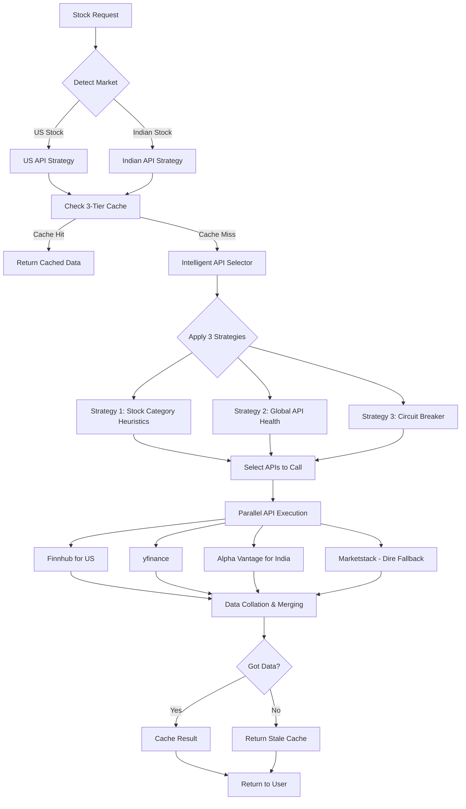

# Smart API Orchestration - Implementation Plan

## Architecture Overview



---

## Component Design

### 1. Market Detection Service

**Purpose**: Detect if stock is US or Indian market

**File**: `backend/app/services/market_detector.py`

**Logic**:
```python
class MarketDetector:
    """Detect stock market based on ticker"""
    
    US_EXCHANGES = ["NYSE", "NASDAQ", "AMEX", "BATS"]
    INDIAN_EXCHANGES = ["NSE", "BSE"]
    
    def detect_market(self, ticker: str) -> str:
        """
        Returns: "US", "INDIA", or "UNKNOWN"
        
        Detection logic:
        1. Check suffix: .NS/.BO → INDIA
        2. Check prefix: NSE:/BSE: → INDIA  
        3. Check symbol list cache (from APIs)
        4. Default: Try INDIA first (since we're India-focused)
        """
        
        # Check suffix
        if ticker.endswith(('.NS', '.BO', '.BSE')):
            return "INDIA"
        
        # Check common US tickers (cached list)
        if ticker in self.us_ticker_cache:
            return "US"
        
        # Check common Indian tickers (cached list)
        if ticker in self.indian_ticker_cache:
            return "INDIA"
        
        # Default to INDIA (our primary market)
        return "INDIA"
```

**Questions**:
1. **Should we maintain a ticker symbol database** for faster detection?
   - Option A: Query APIs once, cache for 30 days
   - Option B: Hardcode top 500 stocks per market
   - Option C: Skip detection, let API selection handle it

2. **Default market when uncertain**?
   - Recommend: INDIA (since it's your primary market)
   - Alternative: Try both markets in parallel

---

### 2. Multi-Tier Caching System

**File**: `backend/app/services/multi_tier_cache.py`

**Architecture**:
```
Tier 1: Memory Cache (Python dict)
  → TTL: 60 seconds
  → Access Time: 1-5ms
  → Scope: Single process
  
Tier 2: Redis Cache
  → TTL: 5 minutes (fresh data)
  → Access Time: 10-50ms
  → Scope: All processes
  
Tier 3: Stale Redis Cache
  → TTL: 1 hour (fallback only)
  → Access Time: 10-50ms
  → Used only when all APIs fail
```

**Implementation**:
```python
class MultiTierCache:
    def __init__(self, redis_client):
        self.memory_cache = {}  # {key: (data, timestamp)}
        self.redis = redis_client
        
        # TTL configurations
        self.MEMORY_TTL = 60        # 1 minute
        self.REDIS_TTL = 300        # 5 minutes
        self.STALE_TTL = 3600       # 1 hour
    
    async def get(self, key: str) -> Optional[Dict]:
        """Get from cache with tier fallthrough"""
        
        # Tier 1: Memory
        if key in self.memory_cache:
            data, ts = self.memory_cache[key]
            if time.time() - ts < self.MEMORY_TTL:
                return {"data": data, "source": "memory_cache", "fresh": True}
        
        # Tier 2: Redis (fresh)
        redis_key = f"stock:{key}"
        cached = await self.redis.get(redis_key)
        if cached:
            data = json.loads(cached)
            age = time.time() - data['cached_at']
            
            if age < self.REDIS_TTL:
                # Fresh data - update memory cache
                self.memory_cache[key] = (data, time.time())
                return {"data": data, "source": "redis_cache", "fresh": True}
            
            elif age < self.STALE_TTL:
                # Stale but usable as fallback
                return {"data": data, "source": "stale_cache", "fresh": False}
        
        return None
    
    async def set(self, key: str, data: Dict):
        """Set in all cache tiers"""
        
        # Tier 1: Memory
        self.memory_cache[key] = (data, time.time())
        
        # Tier 2: Redis with metadata
        cache_entry = {
            **data,
            "cached_at": time.time()
        }
        
        redis_key = f"stock:{key}"
        await self.redis.setex(
            redis_key,
            self.STALE_TTL,  # Keep for full hour (for stale fallback)
            json.dumps(cache_entry, default=str)
        )
```

**Questions**:
3. **Is Redis already set up and running**?
   - If yes: What's the connection string?
   - If no: Should I add Redis to docker-compose.yml?

4. **Cache TTL preferences**?
   - Current: Memory=60s, Redis=300s, Stale=3600s
   - Too aggressive? Too conservative?
   - Different TTL for different data types (quotes vs historical)?

5. **Memory cache size limits**?
   - Current: Unlimited (could grow large)
   - Recommended: LRU eviction after 1000 entries
   - Your preference?

---

### 3. Intelligent API Selection Strategies

#### Strategy 1: Stock Category Heuristics

**File**: `backend/app/services/api_selector_heuristics.py`

**Based on POC data**:
```python
API_SELECTION_RULES = {
    # US Market Rules
    "US": {
        "large_cap": {
            "primary": ["finnhub", "yfinance"],
            "secondary": [],
            "skip": ["alpha_vantage", "marketstack"]
        },
        "mid_cap": {
            "primary": ["finnhub", "yfinance"],
            "secondary": [],
            "skip": ["alpha_vantage", "marketstack"]
        },
        "small_cap": {
            "primary": ["yfinance"],
            "secondary": ["finnhub"],
            "skip": ["alpha_vantage", "marketstack"]
        },
        "unknown": {
            "primary": ["yfinance", "finnhub"],
            "secondary": [],
            "skip": []
        }
    },
    
    # Indian Market Rules (from POC results)
    "INDIA": {
        "large_cap": {
            "primary": ["yfinance"],
            "secondary": ["alpha_vantage"],  # 100% success for large cap
            "skip": ["finnhub", "marketstack"]  # finnhub=403, marketstack=429
        },
        "mid_cap": {
            "primary": ["yfinance"],
            "secondary": ["alpha_vantage"],  # 80% success
            "skip": ["finnhub", "marketstack"]
        },
        "small_cap": {
            "primary": ["yfinance"],  # 100% success!
            "secondary": [],
            "skip": ["finnhub", "alpha_vantage", "marketstack"]
        },
        "micro_cap": {
            "primary": ["yfinance"],  # 80% success
            "secondary": [],
            "skip": ["finnhub", "alpha_vantage", "marketstack"]
        },
        "unknown": {
            "primary": ["yfinance"],
            "secondary": ["alpha_vantage"],
            "fallback": ["marketstack"]  # Dire fallback
        }
    }
}

def determine_stock_category(ticker: str, market_cap: Optional[float] = None) -> str:
    """
    Determine stock category
    
    Market cap thresholds (India):
    - Large cap: > ₹20,000 crore
    - Mid cap: ₹5,000 - ₹20,000 crore
    - Small cap: ₹500 - ₹5,000 crore
    - Micro cap: < ₹500 crore
    """
    if market_cap is None:
        return "unknown"
    
    if market_cap > 20000_00_00_000:  # ₹20,000 crore
        return "large_cap"
    elif market_cap > 5000_00_00_000:  # ₹5,000 crore
        return "mid_cap"
    elif market_cap > 500_00_00_000:  # ₹500 crore
        return "small_cap"
    else:
        return "micro_cap"
```

**Questions**:
6. **Market cap detection**?
   - Fetch from API during first call?
   - Maintain database of known stocks?
   - Default to "unknown" category?

7. **Update heuristics based on runtime data**?
   - Option A: Hardcoded (from POC findings)
   - Option B: Update weekly based on success rates
   - Option C: Manual updates only

---

#### Strategy 2: Global API Health Tracking

**File**: `backend/app/services/api_health_tracker.py`

**Storage**: Redis (lightweight, fast)

**Data Structure**:
```python
{
    "api_health": {
        "finnhub_us": {
            "total_calls": 1250,
            "successes": 1180,
            "failures": 70,
            "success_rate": 0.944,
            "last_100": [1,1,1,0,1,1,1,1,1,1,...],  # Circular buffer
            "circuit_open": false,
            "last_failure": "2025-12-12T23:30:00",
            "failure_streak": 0
        },
        "finnhub_india": {
            "total_calls": 520,
            "successes": 0,
            "failures": 520,
            "success_rate": 0.0,
            "circuit_open": true,  # ← Circuit broken!
            "opened_at": "2025-12-12T22:00:00"
        },
        "yfinance_india": {
            "total_calls": 2450,
            "successes": 2205,
            "failures": 245,
            "success_rate": 0.90,
            "circuit_open": false
        },
        "alpha_vantage_india": {
            "total_calls": 150,
            "successes": 68,
            "failures": 82,
            "success_rate": 0.453,
            "rate_limited_count": 45,
            "circuit_open": false
        }
    }
}
```

**Circuit Breaker Logic**:
```python
class APIHealthTracker:
    CIRCUIT_BREAKER_THRESHOLD = 0.3  # Open if < 30% success
    CIRCUIT_RECOVERY_TIME = 300      # 5 minutes
    
    async def should_skip_api(self, api_name: str, market: str) -> bool:
        """Check if API should be skipped due to poor health"""
        
        key = f"{api_name}_{market.lower()}"
        health = await self.get_health(key)
        
        # Check if circuit is open
        if health.get('circuit_open'):
            # Check if recovery time has passed
            opened_at = health.get('opened_at')
            if time.time() - opened_at < self.CIRCUIT_RECOVERY_TIME:
                return True  # Skip - circuit still open
            else:
                # Try recovery
                await self.close_circuit(key)
                return False
        
        # Check success rate
        if health.get('success_rate', 1.0) < self.CIRCUIT_BREAKER_THRESHOLD:
            # Open circuit
            await self.open_circuit(key)
            return True
        
        return False
    
    async def record_result(self, api_name: str, market: str, success: bool):
        """Record API call result"""
        key = f"{api_name}_{market.lower()}"
        
        # Update counters
        field = "successes" if success else "failures"
        await self.redis.hincrby(f"api_health:{key}", field, 1)
        await self.redis.hincrby(f"api_health:{key}", "total_calls", 1)
        
        # Update circular buffer (last 100 calls)
        await self.update_recent_calls(key, success)
        
        # Recalculate success rate
        await self.update_success_rate(key)
```

**Questions**:
8. **Circuit breaker thresholds**?
   - Current: Open if < 30% success over last 100 calls
   - Recovery time: 5 minutes
   - Too aggressive? Too lenient?

9. **Health data persistence**?
   - Store in Redis (volatile, lost on restart)
   - Store in MySQL (persistent, slower)
   - Hybrid: Redis for hot data, MySQL for analytics

10. **Reset frequency**?
    - Option A: Never reset (cumulative)
    - Option B: Reset daily
    - Option C: Sliding window (last 24 hours)

---

#### Strategy 3: Time-Window Based Circuit Breaker

**File**: Built into `APIHealthTracker`

**Implementation**:
```python
class TimeWindowCircuitBreaker:
    """Track failures in sliding time window"""
    
    def __init__(self, window_minutes=5, failure_threshold=10):
        self.window_minutes = window_minutes
        self.failure_threshold = failure_threshold
    
    async def check_window(self, api_name: str, market: str) -> bool:
        """Check if too many failures in recent window"""
        
        key = f"failures:{api_name}_{market}"
        now = time.time()
        window_start = now - (self.window_minutes * 60)
        
        # Get failures in time window
        failures = await self.redis.zrangebyscore(
            key,
            window_start,
            now
        )
        
        if len(failures) >= self.failure_threshold:
            logger.warning(
                f"Circuit breaker: {api_name} for {market} "
                f"has {len(failures)} failures in {self.window_minutes} minutes"
            )
            return True  # Too many failures, skip API
        
        return False
    
    async def record_failure(self, api_name: str, market: str, error: str):
        """Record a failure with timestamp"""
        
        key = f"failures:{api_name}_{market}"
        failure_data = {
            "timestamp": time.time(),
            "error": error[:100]  # Truncate error message
        }
        
        # Add to sorted set (sorted by timestamp)
        await self.redis.zadd(
            key,
            {json.dumps(failure_data): time.time()}
        )
        
        # Expire old failures (keep for 1 hour)
        await self.redis.expire(key, 3600)
```

**Questions**:
11. **Time window configuration**?
    - Current: 5-minute window, 10 failures triggers circuit
    - For Indian stocks with Finnhub: Should open immediately?
    - Different thresholds per API?

---

### 4. Smart API Orchestrator (Main Component)

**File**: `backend/app/services/smart_api_orchestrator.py`

**Core Logic**:
```python
class SmartAPIOrchestrator:
    """Intelligent API orchestration with multi-strategy selection"""
    
    def __init__(self, cache, health_tracker, market_detector):
        self.cache = cache
        self.health = health_tracker
        self.detector = market_detector
        self.stock_api_service = StockAPIService()  # Existing service
    
    async def get_stock_data(
        self,
        ticker: str,
        use_cache: bool = True,
        force_refresh: bool = False
    ) -> Dict:
        """
        Main entry point - intelligent stock data fetching
        
        Flow:
        1. Check 3-tier cache (unless force_refresh)
        2. Detect market (US vs INDIA)
        3. Apply 3 intelligent selection strategies
        4. Execute parallel API calls
        5. Collate and merge results
        6. Cache result
        7. Return (never "no data")
        """
        
        # Step 1: Check cache
        if use_cache and not force_refresh:
            cached = await self.cache.get(ticker)
            if cached and cached.get('fresh'):
                logger.info(f"✅ Cache hit (fresh): {ticker}")
                return cached['data']
        
        # Step 2: Detect market
        market = self.detector.detect_market(ticker)
        logger.info(f"📍 Market detected: {ticker} → {market}")
        
        # Step 3: Select APIs using all 3 strategies
        selected_apis = await self.select_apis(ticker, market)
        logger.info(f"🎯 Selected APIs: {selected_apis}")
        
        if not selected_apis:
            # All APIs circuit-broken, use stale cache
            if use_cache:
                cached = await self.cache.get(ticker)
                if cached:
                    logger.warning(f"⚠️  All APIs unavailable, using stale cache")
                    return {**cached['data'], "warning": "Using cached data (all APIs unavailable)"}
            
            return {"error": "No APIs available", "ticker": ticker}
        
        # Step 4: Parallel API execution
        results = await self.execute_parallel(ticker, selected_apis, market)
        
        # Step 5: Data collation
        merged_data = await self.merge_results(results, ticker, market)
        
        # Step 6: Cache if successful
        if merged_data and not merged_data.get('error'):
            await self.cache.set(ticker, merged_data)
        
        # Step 7: Fallback to stale if no data
        if not merged_data or merged_data.get('error'):
            cached = await self.cache.get(ticker)
            if cached:
                return {**cached['data'], "warning": "API calls failed, using cached data"}
            
            # Last resort: return partial data
            return {
                "ticker": ticker,
                "error": "Unable to fetch data",
                "message": "All APIs failed and no cache available"
            }
        
        return merged_data
    
    async def select_apis(self, ticker: str, market: str) -> List[str]:
        """
        Apply all 3 intelligent selection strategies
        
        Returns: List of API names to call
        """
        
        # Determine stock category (for Strategy 1)
        market_cap = await self.get_market_cap_estimate(ticker)
        category = determine_stock_category(ticker, market_cap)
        
        # Strategy 1: Heuristics
        heuristic_apis = API_SELECTION_RULES[market][category]
        primary = heuristic_apis['primary']
        secondary = heuristic_apis['secondary']
        fallback = heuristic_apis.get('fallback', [])
        
        # Strategy 2 & 3: Health check + Circuit breaker
        available_apis = []
        
        for api_name in primary + secondary:
            # Check health
            if await self.health.should_skip_api(api_name, market):
                logger.info(f"⛔ Skipping {api_name} (circuit open)")
                continue
            
            available_apis.append(api_name)
        
        # If no APIs available, try fallback (dire straits)
        if not available_apis and fallback:
            logger.warning(f"⚠️  Using dire fallback: {fallback}")
            available_apis = fallback
        
        return available_apis
    
    async def execute_parallel(
        self,
        ticker: str,
        apis: List[str],
        market: str
    ) -> List[Dict]:
        """Execute API calls in parallel with timeout"""
        
        tasks = []
        for api_name in apis:
            task = self.call_api_with_tracking(ticker, api_name, market)
            tasks.append(task)
        
        # Parallel execution with aggressive timeout
        try:
            results = await asyncio.wait_for(
                asyncio.gather(*tasks, return_exceptions=True),
                timeout=3.0  # 3 seconds max
            )
            return [r for r in results if not isinstance(r, Exception)]
        
        except asyncio.TimeoutError:
            logger.warning(f"⏱️ Parallel execution timeout for {ticker}")
            # Return whatever we got so far
            return []
    
    async def call_api_with_tracking(
        self,
        ticker: str,
        api_name: str,
        market: str
    ) -> Optional[Dict]:
        """Call API and track result in health system"""
        
        start = time.time()
        
        try:
            # Use existing StockAPIService
            data = await self.stock_api_service.get_stock_data_from_provider(
                ticker, api_name
            )
            
            elapsed = time.time() - start
            
            if data and not data.get('error'):
                # Success!
                await self.health.record_result(api_name, market, success=True)
                logger.info(f"✅ {api_name}: {ticker} ({elapsed:.2f}s)")
                return {**data, "api_source": api_name, "response_time": elapsed}
            else:
                # API returned error
                await self.health.record_result(api_name, market, success=False)
                await self.health.record_failure(api_name, market, str(data.get('error')))
                logger.warning(f"❌ {api_name}: {ticker} - {data.get('error')}")
                return None
        
        except Exception as e:
            elapsed = time.time() - start
            await self.health.record_result(api_name, market, success=False)
            await self.health.record_failure(api_name, market, str(e))
            logger.error(f"❌ {api_name}: {ticker} - Exception: {e}")
            return None
    
    async def merge_results(
        self,
        results: List[Dict],
        ticker: str,
        market: str
    ) -> Dict:
        """
        Merge data from multiple APIs using quality scoring
        
        Priority:
        1. Most complete data (most non-null fields)
        2. Most recent timestamp
        3. Fastest API (lowest latency)
        """
        
        if not results:
            return None
        
        # Score each result
        scored_results = []
        for result in results:
            score = self.calculate_quality_score(result)
            scored_results.append((score, result))
        
        # Sort by score (highest first)
        scored_results.sort(key=lambda x: x[0], reverse=True)
        
        # Start with best result as base
        best_result = scored_results[0][1]
        merged = dict(best_result)
        
        # Fill in missing fields from other results
        for score, result in scored_results[1:]:
            for field in ['price', 'previous_close', 'high', 'low', 'volume', 'market_cap']:
                if not merged.get(field) and result.get(field):
                    merged[field] = result[field]
                    merged[f'{field}_source'] = result.get('api_source')
        
        # Add metadata
        merged['sources'] = [r.get('api_source') for r in results]
        merged['quality_score'] = scored_results[0][0]
        merged['merged_from'] = len(results)
        
        return merged
    
    def calculate_quality_score(self, data: Dict) -> float:
        """
        Calculate quality score for API response
        
        Scoring:
        - Completeness: 0-50 points (% of fields populated)
        - Recency: 0-25 points (based on timestamp)
        - Speed: 0-25 points (response time)
        """
        score = 0.0
        
        # Completeness (50 points max)
        required_fields = ['price', 'previous_close', 'high', 'low', 'volume']
        populated = sum(1 for f in required_fields if data.get(f))
        completeness = (populated / len(required_fields)) * 50
        score += completeness
        
        # Recency (25 points max)
        # Prefer data with recent timestamps
        # For now, assume all real-time
        score += 25
        
        # Speed (25 points max)
        response_time = data.get('response_time', 2.0)
        speed_score = max(0, 25 - (response_time * 10))
        score += speed_score
        
        return score
```

**Questions**:
12. **Parallel execution timeout**?
    - Current: 3 seconds total
    - Too aggressive? (might cut off slow APIs)
    - Per-API timeout vs total timeout?

13. **Data merging strategy**?
    - Current: Best result + fill missing fields
    - Alternative: Average prices from multiple sources?
    - Conflict resolution (if prices differ significantly)?

---

## Implementation Checklist

### Phase 1: Foundation (Days 1-2)
- [ ] Create `market_detector.py` - Market detection logic
- [ ] Create `multi_tier_cache.py` - 3-tier caching
- [ ] Set up Redis (if not already)
- [ ] Write unit tests for cache

### Phase 2: Intelligence (Days 3-4)
- [ ] Create `api_health_tracker.py` - Health tracking
- [ ] Create `api_selector_heuristics.py` - Strategy 1
- [ ] Implement circuit breaker - Strategy 2 & 3
- [ ] Write unit tests for selection logic

### Phase 3: Orchestration (Days 5-6)
- [ ] Create `smart_api_orchestrator.py` - Main orchestrator
- [ ] Implement parallel execution
- [ ] Implement data merging
- [ ] Write integration tests

### Phase 4: Integration (Day 7)
- [ ] Update `StockAPIService` to use orchestrator
- [ ] Update API routes to use new system
- [ ] Migrate existing code
- [ ] Update configuration

### Phase 5: Testing & Validation (Days 8-9)
- [ ] Test with diverse stock universe
- [ ] Load testing (100 concurrent requests)
- [ ] Verify cache hit rates
- [ ] Verify circuit breaker works
- [ ] Test all fallback scenarios

### Phase 6: Monitoring & Deployment (Day 10)
- [ ] Add logging and metrics
- [ ] Create dashboard for API health
- [ ] Deploy to staging
- [ ] Monitor for 24 hours
- [ ] Deploy to production

---

## Questions for You

### Critical Questions (Need answers to proceed)

**1. Redis Setup**:
- Is Redis currently running?
- Connection string?
- If not: Should I add to docker-compose.yml?

**2. Market Detection**:
- Should we query APIs to build ticker→market mapping?
- Or maintain hardcoded list of common stocks?
- Default to INDIA or US when uncertain?

**3. Cache TTLs**:
- Memory: 60s OK?
- Redis fresh: 300s (5 min) OK?
- Stale: 3600s (1 hour) OK?
- Different TTL for quotes vs historical?

**4. Circuit Breaker**:
- Threshold: < 30% success over 100 calls OK?
- Recovery time: 5 minutes OK?
- For Finnhub+India: Permanently open circuit?

**5. Health Data Storage**:
- Redis (fast, volatile) or MySQL (slow, persistent)?
- Reset frequency: Daily? Never? Sliding window?

**6. Parallel Execution**:
- Total timeout: 3 seconds OK?
- Return on first success or wait for all?
- Maximum concurrent API calls?

### Nice-to-Have Questions

**7. Market Cap Detection**:
- Fetch dynamically or maintain database?
- Default category when unknown?

**8. Data Merging**:
- Use quality scoring or simple priority?
- How to handle price conflicts?

**9. Monitoring**:
- Want Prometheus metrics?
- Want API health dashboard UI?
- Just logs sufficient?

**10. Deployment**:
- Feature flag for gradual rollout?
- A/B test old vs new system?
- Direct cutover?

---

## Next Steps

**After you answer the questions**, I will:

1. ✅ Create all service files with exact implementation
2. ✅ Set up Redis if needed
3. ✅ Write comprehensive tests
4. ✅ Update existing code to use new orchestrator
5. ✅ Create configuration files
6. ✅ Deploy and validate

**Estimated Time**: 7-10 days for full implementation

**Your Priority**: Reliability & Data Quality → Speed
**My Approach**: Thorough, tested, production-ready code

Ready when you are! 🚀
